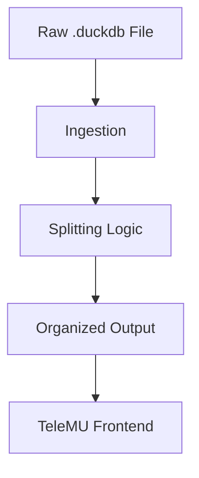

# Data Pipeline

## Input Format

Le Mans Ultimate exports telemetry as `.duckdb` database files. These contain raw session data including lap times, tire data, fuel usage, weather conditions, and vehicle telemetry channels.

## Pipeline Stages

### 1. Ingestion
Read the raw `.duckdb` file using DuckDB's Python API. Discover available tables and schema.

### 2. Splitting
Separate the raw data into logical groups. The splitting logic is kept as its own module, independent from the LMUPI application layer.

!!! note "TODO"
    Define the exact splitting strategy once the `.duckdb` schema from LMU is documented.

### 3. Output
Processed data is written out in a format consumable by the TeleMU Electrobun frontend.

!!! note "TODO"
    Determine the interchange format between LMUPI and TeleMU (e.g. JSON, Parquet, or a shared DuckDB file).
