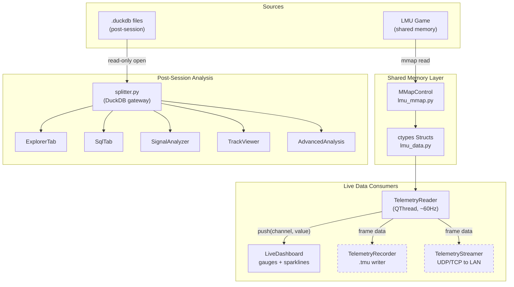
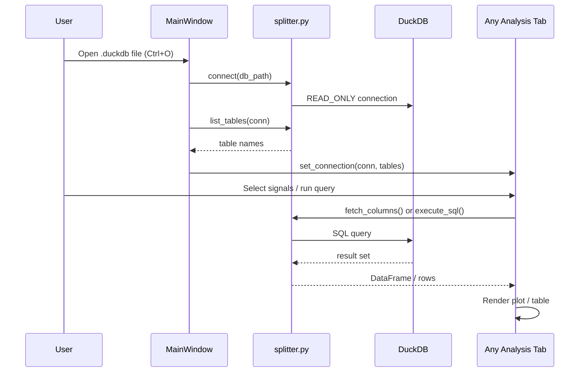
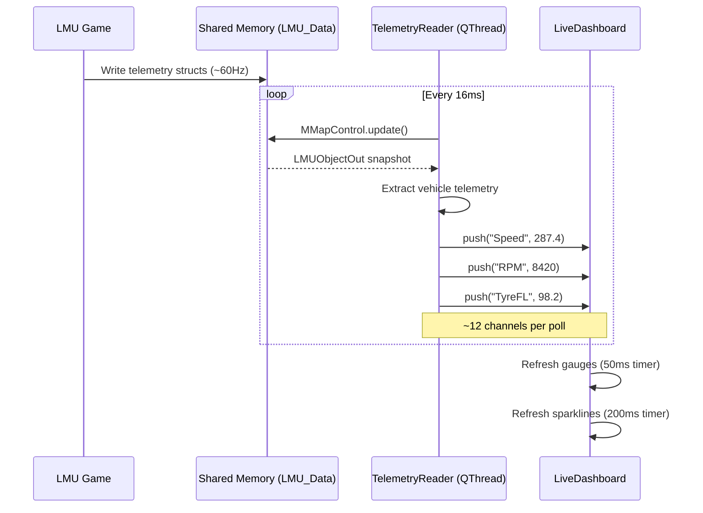
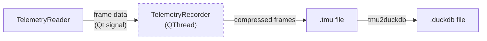
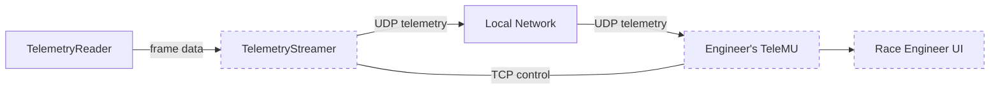

# Data Pipeline

TeleMU has four data flows: post-session analysis, live dashboard, session recording, and LAN streaming. All live flows originate from LMU's shared memory; post-session analysis reads `.duckdb` files.

## Full Pipeline Overview

## Flow 1 — Post-Session Analysis

The original and most mature flow. A driver loads a `.duckdb` file after a session.

**Key details:**

- `splitter.py` is the **only** module that issues SQL
- Tables with a `ts` column are INNER JOINed on `ts` for cross-table queries
- Tables without `ts` are row-aligned and shown with a visual indicator in the UI
- All connections are read-only — analysis never mutates source data

## Flow 2 — Live Dashboard

The driver runs LMU and TeleMU simultaneously. Telemetry flows from shared memory to the dashboard in real time.

**Key details:**

- `MMapControl` uses **copy mode** by default — snapshots the buffer only when both scoring and telemetry updates are flagged, ensuring consistency
- `TelemetryReader` extracts the player's vehicle using `playerVehicleIdx`
- Speed is computed from `mLocalVel` vector magnitude × 3.6 (m/s → km/h)
- Tyre temps use the centre reading (`mTemperature[1]`) converted from Kelvin
- Status indicators (DRS, PIT, FLAG, TC, ABS) are derived from scoring and telemetry deltas

## Flow 3 — Session Recording (Planned)

Captures live telemetry to a `.tmu` file for later replay or conversion to DuckDB.

**Design:**

- Recorder runs on its own QThread, receives frame data via Qt signal from `TelemetryReader`
- Writes frames with timestamps and zstd compression
- `.tmu` files can be replayed in the dashboard or converted to `.duckdb` for post-session analysis
- See [Recording Overview](../recording/overview.md) for format spec

## Flow 4 — LAN Streaming (Planned)

Streams telemetry from the driver's PC to a race engineer's PC over the local network.

**Design:**

- UDP for high-frequency telemetry (low latency, tolerates drops)
- TCP for control messages (connect, subscribe, session info)
- UDP multicast or broadcast for discovery on LAN
- See [Streaming Overview](../streaming/overview.md) and [Protocol Spec](../streaming/protocol.md)

## Agent Notes

- When implementing a new data consumer, connect to `TelemetryReader`'s Qt signals — do not read shared memory directly
- The post-session flow is stable; the live flow is working; recording and streaming are planned
- Recording should follow the QThread pattern established by `TelemetryReader`
- The `.tmu` → `.duckdb` converter should produce files compatible with the existing `splitter.py` API
- Files to reference: `telemetry_reader.py` (signal definitions), `dashboard.py` (consumer pattern), `splitter.py` (DuckDB schema expectations)
