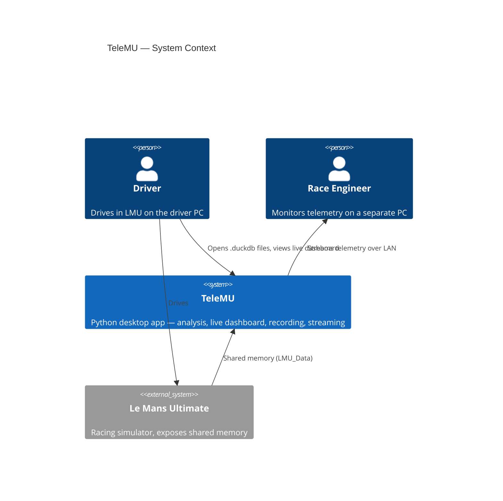
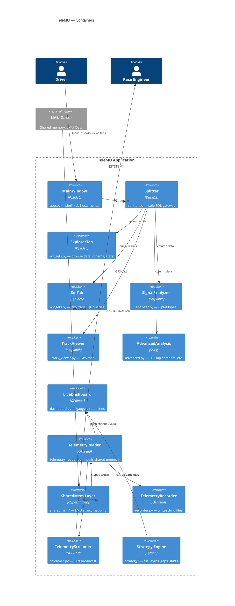

# Architecture Overview

TeleMU is a single Python desktop application that combines post-session analysis with live telemetry access, session recording, LAN streaming, and race engineering tools.

## C4 System Context

## C4 Container Diagram

!!! info "Status Legend"
    - **Solid borders** = implemented and working
    - Recorder, Streamer, and Strategy Engine are **planned** subsystems (see dashed references in diagrams elsewhere)

## Design Principles

1. **Single app** — everything runs in one PySide6 process; no separate frontend/backend
2. **Splitter is the SQL gateway** — all DuckDB queries go through `splitter.py`, no other module opens connections
3. **Push-based live data** — `TelemetryReader` pushes values to consumers (dashboard, recorder, streamer) via Qt signals
4. **QThread for background work** — any I/O or polling runs on a QThread, never on the GUI thread
5. **Read-only analysis** — `.duckdb` files are opened read-only; analysis never mutates source data
6. **Modular tabs** — each tab is a self-contained QWidget; MainWindow only wires connections

## Tech Stack

| Layer | Technology | Notes |
|-------|-----------|-------|
| UI Framework | PySide6 / Qt6 | Dark theme via `theme.py` |
| Data Engine | DuckDB | Read-only, accessed only via `splitter.py` |
| Analysis | NumPy, SciPy | FFT, rolling stats, cross-correlation |
| Plotting | Matplotlib | Embedded in Qt via `FigureCanvasQTAgg` |
| Live Gauges | QPainter | Custom `GaugeWidget`, `SparkStripWidget` |
| Shared Memory | ctypes + mmap | Maps LMU's `SharedMemoryInterface.hpp` |
| Package Manager | uv | `pyproject.toml` in `LMUPI/` |

## Agent Notes

- The C4 container diagram is the canonical reference for how modules connect
- When adding a new subsystem (recorder, streamer, strategy), create it as a module under `LMUPI/lmupi/` and wire it into `app.py`
- Follow the push-based pattern: `TelemetryReader` emits signals, new consumers connect to those signals
- All DuckDB access must go through `splitter.py` — never import `duckdb` directly in other modules
- Related issues: see project issue tracker for recording (#), streaming (#), and strategy (#) features
