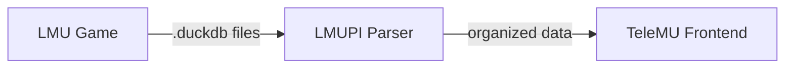

# Architecture Overview

TeleMU follows a two-stage pipeline: **parse** then **view**.

## Design Principles

- **Separation of concerns** — the Python parser (LMUPI) and the Electrobun frontend (TeleMU) are independent projects
- **LMUPI** handles all data ingestion, splitting, and transformation logic
- **TeleMU** is a pure presentation layer that consumes already-processed data
- The splitting/transformation logic within LMUPI is kept modular and separate from the application entry point

## Tech Stack

### LMUPI (Backend)
- **Python 3.13+** managed with **uv**
- **DuckDB** for reading telemetry databases
- **NumPy / SciPy** for numerical analysis
- **Matplotlib** for any server-side plotting

### TeleMU (Frontend)
- **Electrobun** — lightweight desktop application framework (not Electron)
- **TypeScript** with **Vite** build tooling
- **Tailwind CSS** for styling
