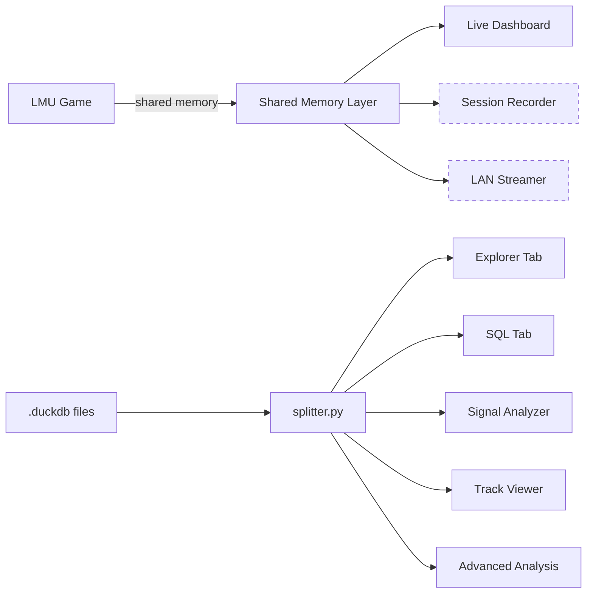

# TeleMU

**Telemetry Analysis Platform for Le Mans Ultimate**

TeleMU is a Python-based telemetry platform for [Le Mans Ultimate](https://www.lemansvirtual.com/). It combines post-session analysis of `.duckdb` telemetry files with live shared-memory access for real-time dashboards, session recording, LAN streaming, and race engineering tools.

## Architecture at a Glance



<small>Dashed borders = planned subsystems</small>

## Components

| Component | Role |
|-----------|------|
| **Shared Memory** | ctypes mapping of LMU's `SharedMemoryInterface`, platform mmap abstraction |
| **Live Dashboard** | Real-time gauges, sparklines, lap info, status indicators |
| **Post-Session Analysis** | 6 tabs: Explorer, SQL, Signal Analyzer, Track Viewer, Advanced Analysis, Dashboard |
| **Recording** | Capture live sessions to `.tmu` files for replay *(planned)* |
| **Streaming** | Stream telemetry over LAN to a race engineer *(planned)* |
| **Race Engineer** | Strategy tools: fuel, tyres, gaps, stints, pit timing *(planned)* |

## Tech Stack

| Layer | Technology |
|-------|-----------|
| UI Framework | PySide6 / Qt6 |
| Data Engine | DuckDB (read-only `.duckdb` access) |
| Analysis | NumPy, SciPy, Matplotlib |
| Live Data | ctypes shared memory (`LMU_Data`) |
| Package Manager | uv |
| Docs | MkDocs Material |

## Quick Start

```bash
cd LMUPI
uv sync
uv run lmupi
```

## Documentation Map

| Section | What You'll Find |
|---------|-----------------|
| [Architecture Overview](architecture/overview.md) | C4 system context and container diagrams |
| [Data Pipeline](architecture/data-pipeline.md) | End-to-end data flow for all subsystems |
| [Shared Memory](shared-memory/overview.md) | MMapControl interface, access modes |
| [Data Structures](shared-memory/data-structures.md) | LMU shared memory field reference |
| [Recording](recording/overview.md) | `.tmu` format spec and recorder design |
| [Playback](recording/playback.md) | Replay and DuckDB conversion |
| [Streaming](streaming/overview.md) | LAN streaming architecture |
| [Protocol Spec](streaming/protocol.md) | Wire formats and sequence diagrams |
| [Race Engineer](race-engineer/overview.md) | Strategy engine architecture |
| [Tool Specs](race-engineer/tools.md) | Per-tool specifications |
| [LMUPI Overview](lmupi/overview.md) | App architecture and module graph |
| [Modules Reference](lmupi/modules.md) | Class and function reference |
| [UI & Tabs](lmupi/ui.md) | Tab layout, keyboard shortcuts |
| [Agent Guide](contributing/agent-guide.md) | Reading order and patterns for LLM agents |
