# LMUPI — Modules Reference

Detailed documentation for every Python module in the `lmupi` package.

---

## Class Overview

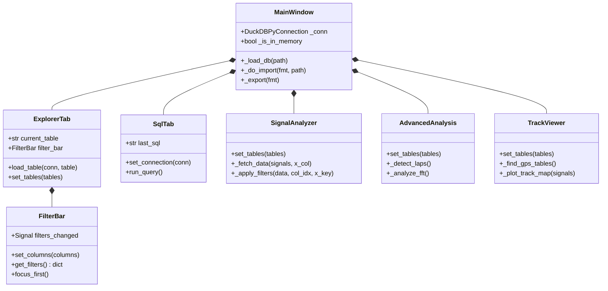

---

## `app.py` — Application Shell

**Class: `MainWindow(QMainWindow)`**

The top-level application window. Owns the DuckDB connection and coordinates all tabs.

### Key attributes

| Attribute | Type | Description |
|---|---|---|
| `_conn` | `duckdb.DuckDBPyConnection \| None` | The active database connection |
| `_db_path` | `Path \| None` | Path to the currently open `.duckdb` file, or `None` for in-memory |
| `_is_in_memory` | `bool` | `True` when the connection is an in-memory import session |
| `_settings` | `QSettings` | Persists recent file list across sessions (`HKCU/LMUPI/TelemetryExplorer`) |
| `_tree` | `QTreeWidget` | Left-panel table browser |
| `_tabs` | `QTabWidget` | Right-panel tab container |

### Initialization sequence

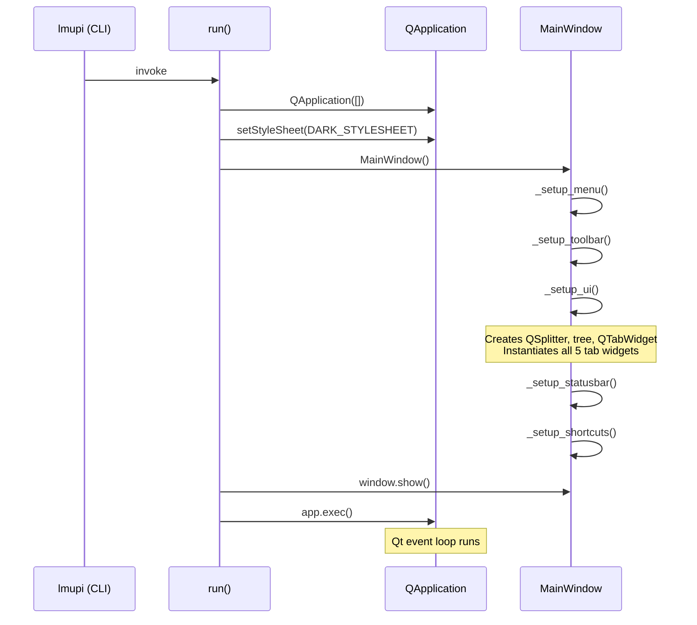

### Database loading sequence

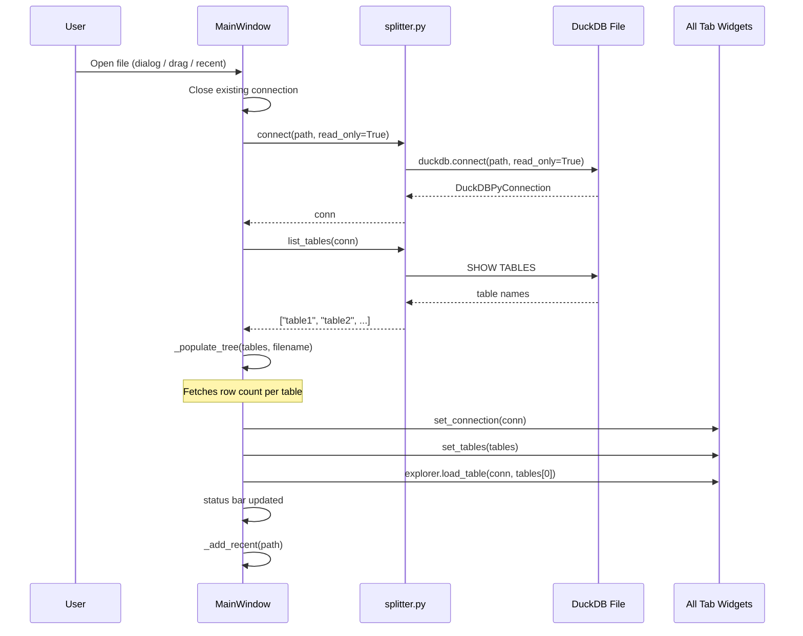

### Drag and drop

`dragEnterEvent` accepts `.duckdb`, `.csv`, and `.json` URLs. `dropEvent` routes `.duckdb` to `_load_db` and CSV/JSON to `_do_import`.

### Export logic

`_export(fmt)` checks which tab is currently active:
- If the **SQL Query** tab is active and has a previous query (`last_sql`), the query results are exported.
- Otherwise the Explorer's currently selected table is exported.

### `run()` function

```python
def run() -> None:
    app = QApplication([])
    app.setStyleSheet(DARK_STYLESHEET)
    window = MainWindow()
    window.show()
    app.exec()
```

---

## `splitter.py` — Database Access Layer

All DuckDB queries are centralized here. No other module calls DuckDB directly.

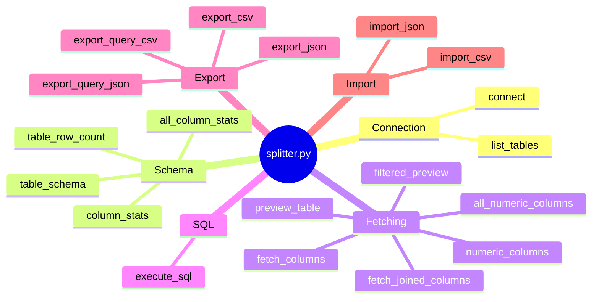

### Connection management

#### `connect(db_path: Path) → duckdb.DuckDBPyConnection`
Opens a **read-only** DuckDB connection to a `.duckdb` file.

```python
return duckdb.connect(str(db_path), read_only=True)
```

#### `list_tables(conn) → list[str]`
Returns all table names via `SHOW TABLES`.

### Schema & statistics

#### `table_schema(conn, table) → list[dict]`
Returns one dict per column:
```python
{"name": str, "type": str, "nullable": bool}
```
Uses `PRAGMA table_info(table)`.

#### `table_row_count(conn, table) → int`
Executes `SELECT COUNT(*) FROM "table"`.

#### `column_stats(conn, table, column, col_type) → dict`

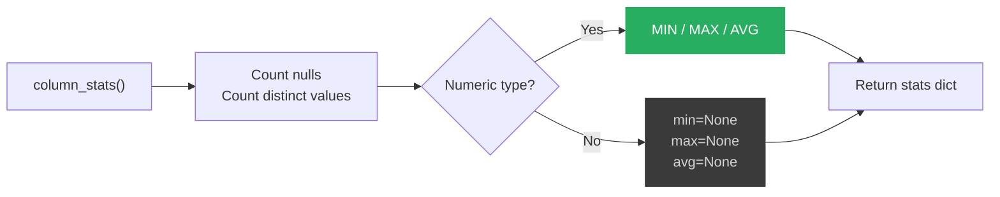

Numeric detection checks for `INT`, `FLOAT`, `DOUBLE`, `DECIMAL`, `NUMERIC`, `BIGINT`, `SMALL`, `TINY`, `HUGEINT`, `REAL` in the type string (case-insensitive).

### Data fetching

#### `preview_table(conn, table, limit=100) → tuple[list[str], list[tuple]]`
`SELECT * FROM "table" LIMIT {limit}`. Returns `(column_names, rows)`.

#### `filtered_preview(conn, table, filters, limit=100) → tuple[list[str], list[tuple]]`
Applies per-column `ILIKE` filters using parameterized queries (prevents SQL injection):
```sql
SELECT * FROM "table"
WHERE CAST("col1" AS VARCHAR) ILIKE ?
  AND CAST("col2" AS VARCHAR) ILIKE ?
LIMIT {limit}
```
Each pattern is wrapped as `%{pattern}%`. Only non-empty filter values are included.

#### `fetch_joined_columns(conn, table_columns, on="ts") → tuple[list[str], list[tuple]]`

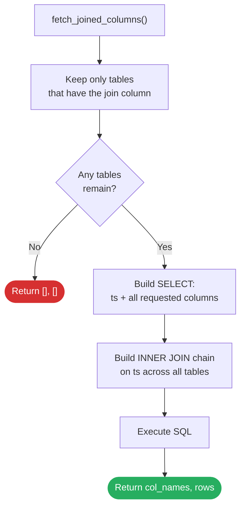

Example for `{"Speed": ["value"], "Throttle": ["value"]}`:
```sql
SELECT "Speed"."ts" AS "ts",
       "Speed"."value" AS "Speed.value",
       "Throttle"."value" AS "Throttle.value"
FROM "Speed"
INNER JOIN "Throttle" ON "Speed"."ts" = "Throttle"."ts"
```

### SQL execution

#### `execute_sql(conn, sql) → tuple[list[str], list[tuple]]`
Executes arbitrary SQL. Raises `duckdb.Error` on failure. Returns `([], [])` for non-SELECT statements that return no description.

### Export

| Function | SQL issued |
|---|---|
| `export_csv(conn, table, path)` | `COPY "table" TO 'path' (FORMAT CSV, HEADER)` |
| `export_query_csv(conn, sql, path)` | `COPY (sql) TO 'path' (FORMAT CSV, HEADER)` |
| `export_json(conn, table, path)` | `COPY "table" TO 'path' (FORMAT JSON)` |
| `export_query_json(conn, sql, path)` | `COPY (sql) TO 'path' (FORMAT JSON)` |

### Import

| Function | SQL issued |
|---|---|
| `import_csv(conn, csv_path, table_name)` | `CREATE TABLE "name" AS SELECT * FROM read_csv_auto('path')` |
| `import_json(conn, json_path, table_name)` | `CREATE TABLE "name" AS SELECT * FROM read_json_auto('path')` |

Single-quotes in paths and double-quotes in table names are escaped before interpolation.

---

## `widgets.py` — Reusable Qt Widgets

### `FilterBar(QWidget)`

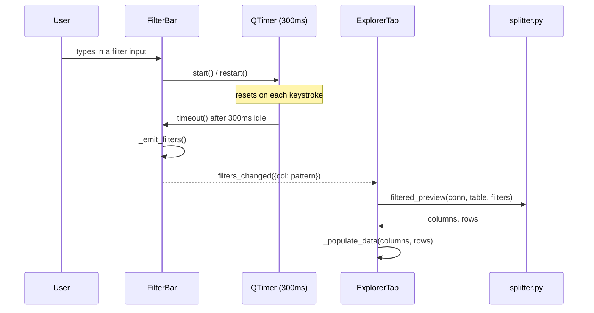

- `set_columns(columns)` — rebuilds all inputs for the given column list.
- `get_filters() → dict[str, str]` — returns only non-empty inputs.
- `clear_filters()` — clears all inputs and immediately emits `filters_changed({})`.
- `focus_first()` — focuses the first input (used by `Ctrl+F` shortcut).

### `ExplorerTab(QWidget)`

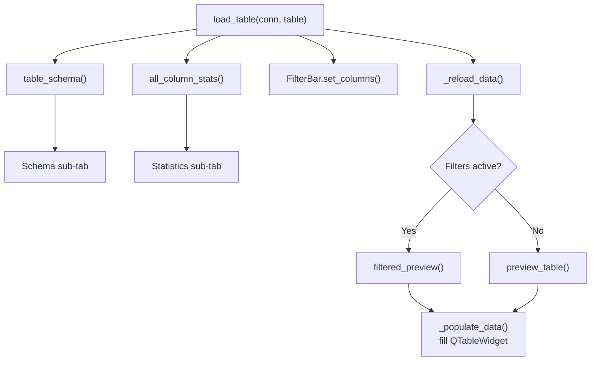

Key methods:
- `set_tables(tables)` — populates the table dropdown.
- `select_table(table)` — selects a table in the dropdown.
- `_get_limit() → int` — parses the rows dropdown; `"All"` returns `0` (passed as `999_999_999` internally).

### `SqlTab(QWidget)`

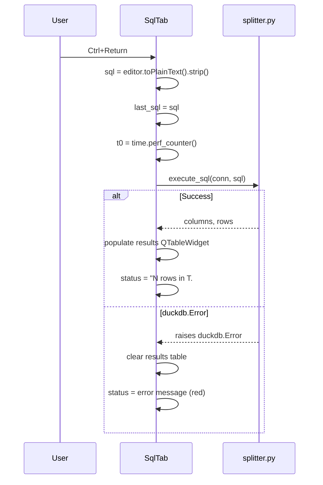

`last_sql` property exposes the last successfully-submitted SQL for use by the export logic in `MainWindow`.

---

## `analyzer.py` — Signal Analyzer

**Class: `SignalAnalyzer(QWidget)` — six plot types for signal comparison and correlation.**

### Data Fetching: `_fetch_data(signals, x_col)`

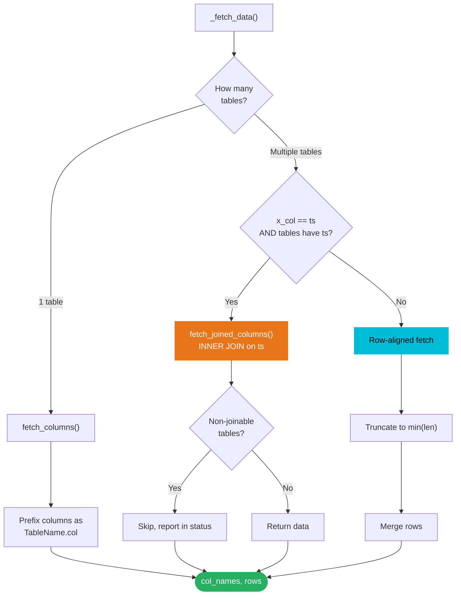

### Filter Pipeline: `_apply_filters(data, col_idx, x_key)`

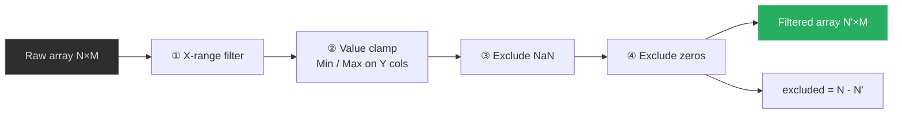

Filters are composed as a boolean numpy mask (`np.ones(N, dtype=bool)`), ANDed step by step, then applied in one shot.

### Helper: `_to_float(val)`

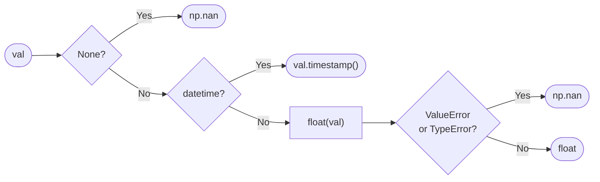

### Plot Type Decision

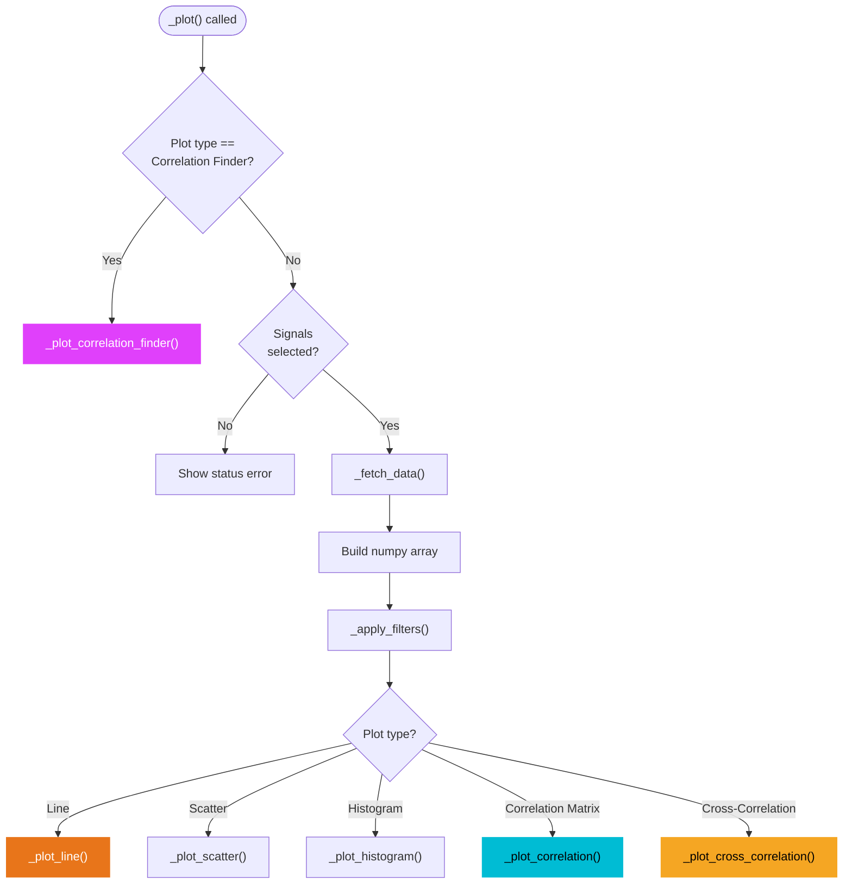

### Dual Y-axis Trigger (Line plot)

When exactly 2 signals are selected and their value ranges differ by more than 10×, the line plot automatically switches to a dual Y-axis layout:

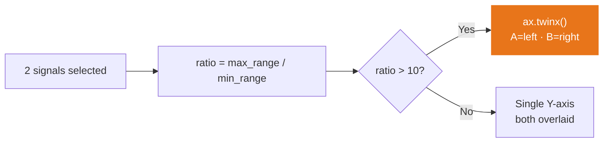

### Correlation Finder Pipeline

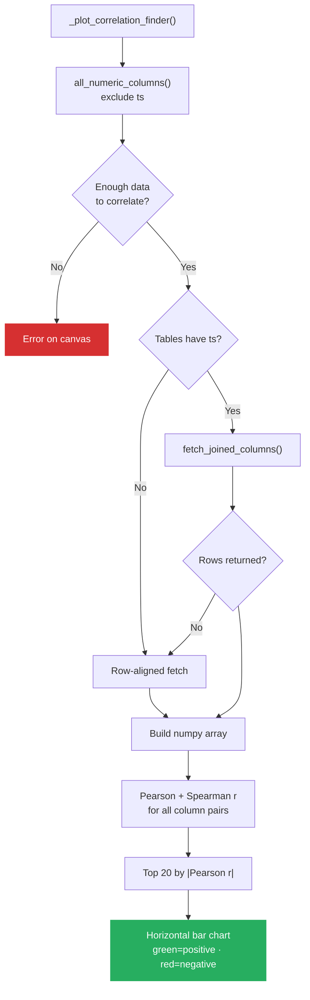

---

## `advanced.py` — Advanced Analysis

**Class: `AdvancedAnalysis(QWidget)` — four specialized analysis modes via a `QStackedWidget`.**

### Analysis Mode Dispatch

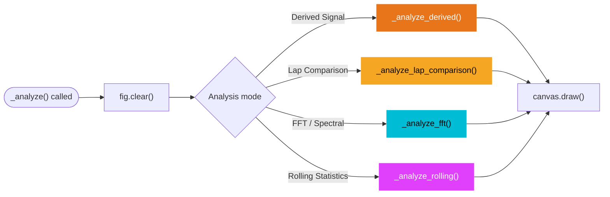

### Helper: `_fetch_table_data(table, col="value")`

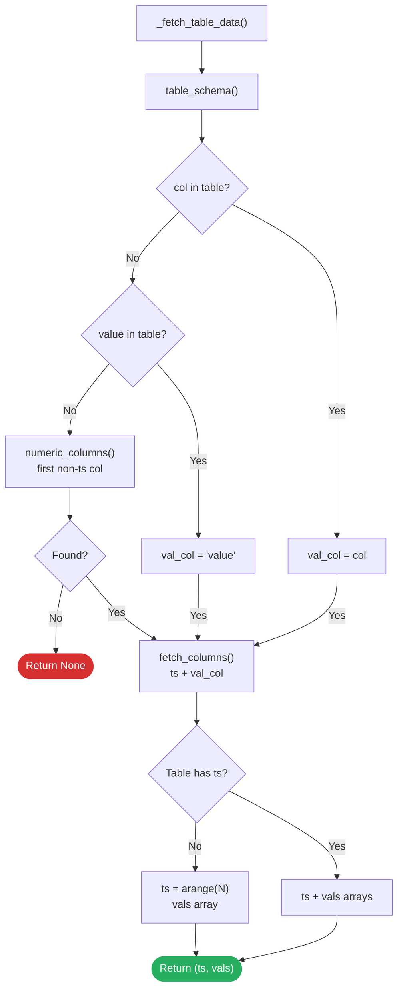

### Derived Signal

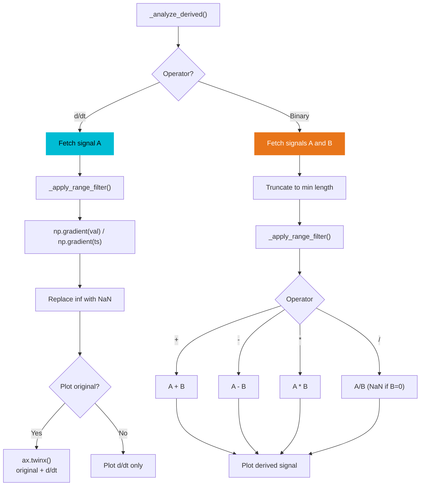

### Lap Detection

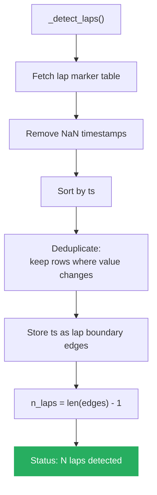

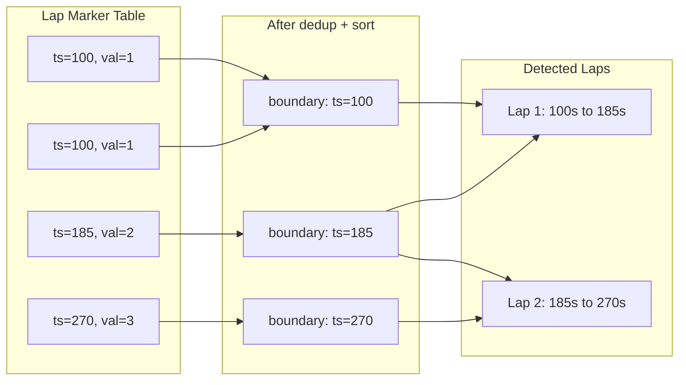

### FFT — Pre-processing

```mermaid
flowchart TD
    A["_analyze_fft()"] --> A1{Exactly 1<br/>signal?}
    A1 -- No --> ERR["Error: need 1 signal"]
    A1 -- Yes --> B["_fetch_table_data()"]
    B --> C["_apply_range_filter()"]
    C --> D["Remove NaN rows"]
    D --> E{len >= 4?}
    E -- No --> ERR2["Error: not enough data"]
    E -- Yes --> F["Estimate sample rate<br/>fs = 1 / median(diff(ts))"]
    F --> G{dt <= 0?}
    G -- Yes --> ERR3["Error: non-monotonic ts"]
    G -- No --> H["DC removal: vals -= mean(vals)"]
    H --> Win["Apply window function"]

    style ERR fill:#d63031,color:#fff,stroke:none
    style ERR2 fill:#d63031,color:#fff,stroke:none
    style ERR3 fill:#d63031,color:#fff,stroke:none
    style Win fill:#e8751a,color:#fff,stroke:none
```

### FFT — Windowing & Spectral Output

```mermaid
flowchart TD
    Win["DC-removed signal"] --> I{Window function}
    I -->|None| W1["np.ones(N)"]
    I -->|Hanning| W2["np.hanning(N)"]
    I -->|Hamming| W3["np.hamming(N)"]
    I -->|Blackman| W4["np.blackman(N)"]
    W1 & W2 & W3 & W4 --> J["Apply window to signal"]
    J --> K["scipy.fft.rfft()"]
    K --> L["Single-sided amplitude:<br/>|yf| / N * 2"]
    L --> M{Max freq set?}
    M -- Yes --> N["Truncate to max_freq"]
    M -- No --> O{Log scale?}
    N --> O
    O -- Yes --> P["20 * log10(mag + epsilon)"]
    O -- No --> Q["Linear amplitude"]
    P & Q --> R["ax.fill_between() + plot()"]

    style Win fill:#e8751a,color:#fff,stroke:none
    style R fill:#27ae60,color:#fff,stroke:none
```

### Rolling Statistics

```mermaid
flowchart LR
    A["_analyze_rolling()"] --> B["For each signal"]
    B --> C["_fetch_table_data()"]
    C --> D["_apply_range_filter()"]
    D --> E{len >= window?}
    E -- No --> SKIP["Skip: not enough data"]
    E -- Yes --> F{Show original?}
    F -- Yes --> G["Plot raw signal<br/>alpha=0.3"]
    F -- No --> H
    G --> H{Statistic}
    H -->|Moving Avg| MA["Moving Average<br/>uniform_filter1d"]
    H -->|Rolling StdDev| SD["Rolling Std Dev<br/>via uniform_filter1d"]
    H -->|Upper Envelope| UE["Upper Envelope<br/>maximum_filter1d"]
    H -->|Lower Envelope| LE["Lower Envelope<br/>minimum_filter1d"]
    H -->|Median Filter| MF["Median Filter<br/>edge-preserving"]
    MA & SD & UE & LE & MF --> Plot["Plot smoothed signal"]

    style SKIP fill:#856404,color:#fff,stroke:none
    style Plot fill:#27ae60,color:#fff,stroke:none
```

---

## `track_viewer.py` — Track Viewer

**Class: `TrackViewer(QWidget)` — GPS track map with colour-by-signal overlay.**

### GPS Table Discovery

```mermaid
flowchart LR
    A["_find_gps_tables()"] --> B["Check each table name<br/>(lowercased)"]
    B --> C{In latitude set?}
    C -- Yes --> LAT["lat_table = tbl"]
    C -- No --> D{In longitude set?}
    D -- Yes --> LON["lon_table = tbl"]
    D -- No --> E{In speed set?}
    E -- Yes --> SPD["speed_table = tbl"]
    LAT & LON & SPD --> F(["Return lat, lon, speed tables"])

    subgraph lat_names["Latitude names"]
        direction TB
        L1["latitude, lat, gps_lat,<br/>gps_latitude, gpslat"]
    end
    subgraph lon_names["Longitude names"]
        direction TB
        L2["longitude, lon, lng,<br/>gps_lon, gps_longitude"]
    end
```

### Track Rendering Pipeline

```mermaid
flowchart TD
    A["_plot_track_map()"] --> B["_find_gps_tables()"]
    B --> C{lat AND<br/>lon found?}
    C -- No --> ERR["Error: list available tables"]
    C -- Yes --> D["Fetch lat & lon values"]
    D --> E["Truncate to min(len_lat, len_lon)"]
    E --> F["Remove NaN and (0,0) dropouts"]
    F --> G["Apply sidebar filters"]
    G --> H{Colour signal<br/>enabled?}
    H -- Yes --> I["Fetch & align colour signal"]
    H -- No --> J
    I --> K["Build LineCollection<br/>cmap=plasma"]
    K --> L["Add colorbar"]
    L --> J["Plot base track (orange)"]
    J --> M["Start / Finish markers"]
    M --> N["ax.set_aspect('equal')"]
    N --> O["apply_plot_theme()"]

    style ERR fill:#d63031,color:#fff,stroke:none
    style O fill:#27ae60,color:#fff,stroke:none
```

---

## `theme.py` — Dark Theme & Plot Colors

### `PLOT_COLORS` Palette

```mermaid
graph LR
    C0["#e8751a<br/>Orange"]
    C1["#f5a623<br/>Amber"]
    C2["#00bcd4<br/>Cyan"]
    C3["#e040fb<br/>Magenta"]
    C4["#27ae60<br/>Green"]
    C5["#d63031<br/>Red"]
    C6["#4fc3f7<br/>Sky Blue"]
    C7["#ab47bc<br/>Violet"]

    C0 -.-> C1 -.-> C2 -.-> C3 -.-> C4 -.-> C5 -.-> C6 -.-> C7 -.-> C0

    style C0 fill:#e8751a,color:#fff,stroke:none
    style C1 fill:#f5a623,color:#000,stroke:none
    style C2 fill:#00bcd4,color:#000,stroke:none
    style C3 fill:#e040fb,color:#fff,stroke:none
    style C4 fill:#27ae60,color:#fff,stroke:none
    style C5 fill:#d63031,color:#fff,stroke:none
    style C6 fill:#4fc3f7,color:#000,stroke:none
    style C7 fill:#ab47bc,color:#fff,stroke:none
```

Colors cycle via `PLOT_COLORS[i % len(PLOT_COLORS)]` across all plot types.

### `apply_plot_theme(fig, ax)`

Applied at the end of every plot method in every tab widget:

| Element | Value |
|---|---|
| Figure background | `#1a1a1a` |
| Axes background | `#242424` |
| Text / tick labels | `#d4d4d4` |
| Grid color | `#3a3a3a`, alpha 0.5, linewidth 0.5 |
| Spines | `#3a3a3a` |
| Legend frame | `#242424` bg, `#3a3a3a` border, `#d4d4d4` text |

### `DARK_STYLESHEET`

A comprehensive Qt Style Sheet string covering every widget class used in LMUPI. The accent color (`#e8751a` orange) is applied to:

```mermaid
mindmap
  root((Accent Color))
    Active tab border-bottom
    Focused QLineEdit border
    QMenuBar item selected
    QMenu item selected
    Toolbar button hover color
    QPushButton accent background
    QTreeWidget item selected
    QComboBox selection color
    QTableWidget selection color
```
