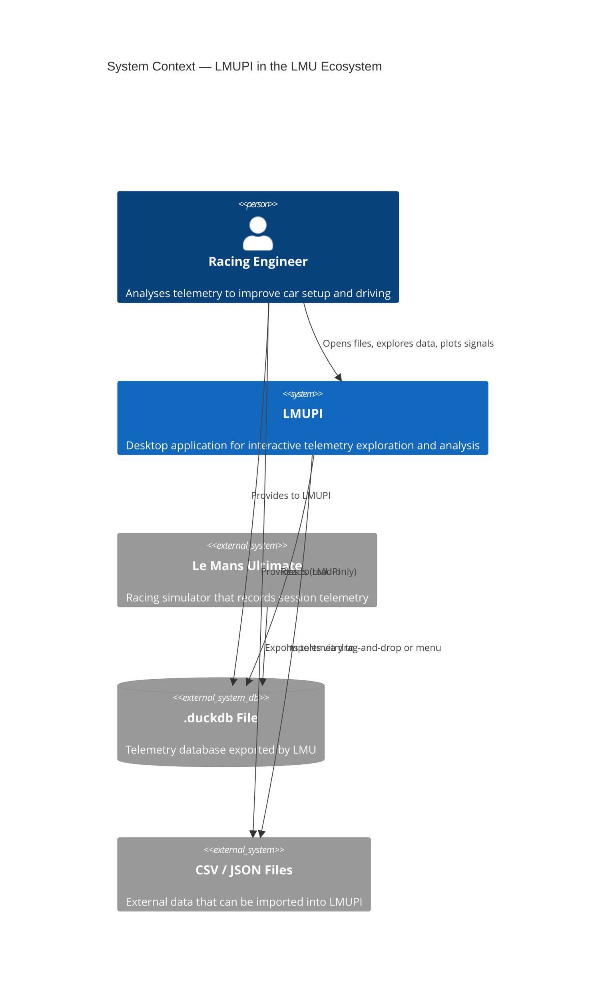
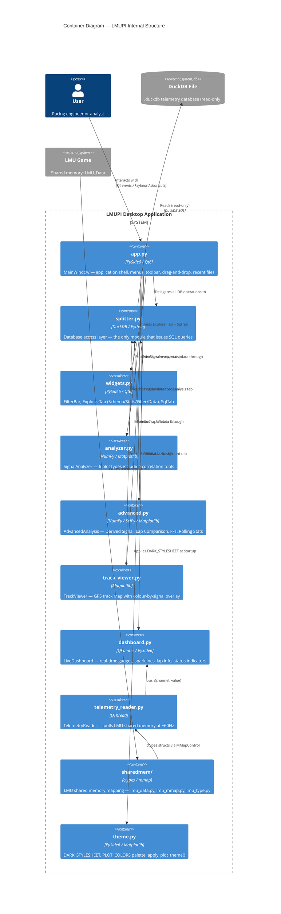
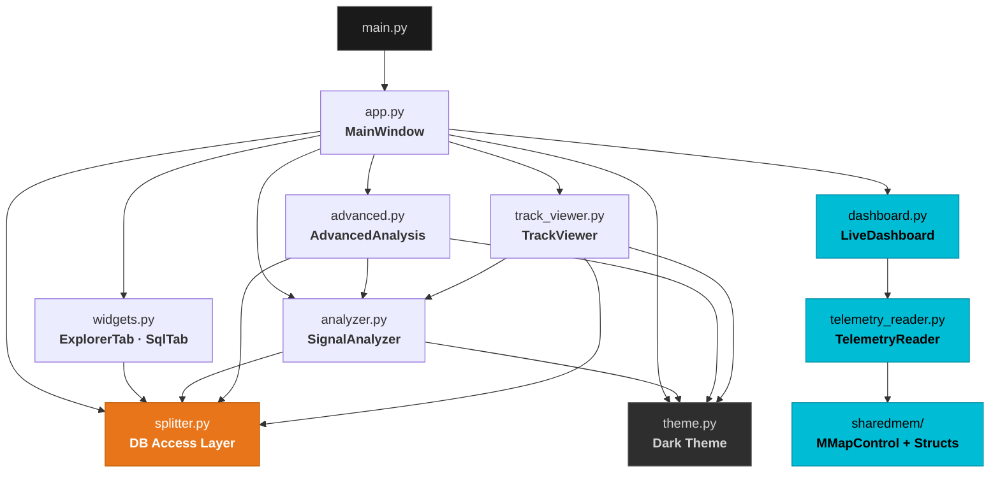
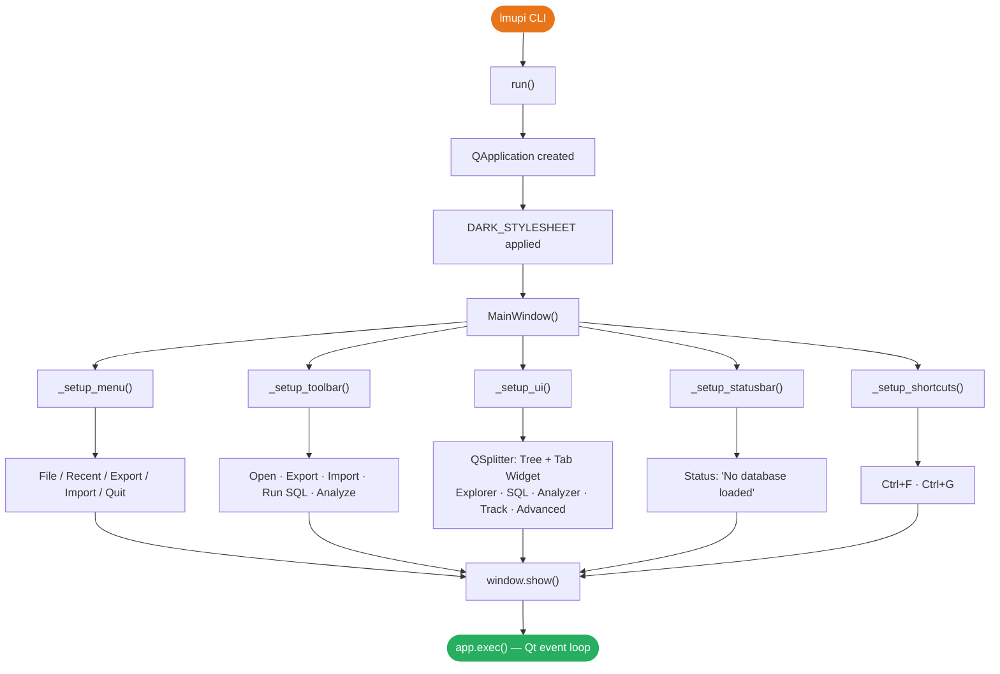
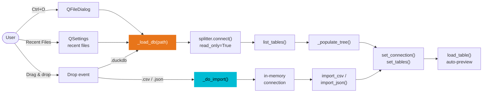
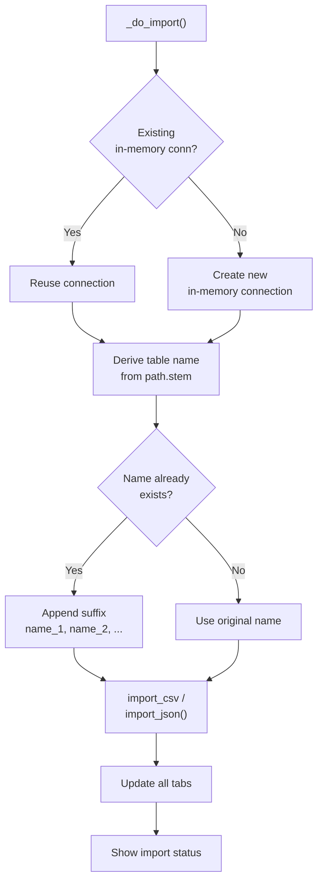
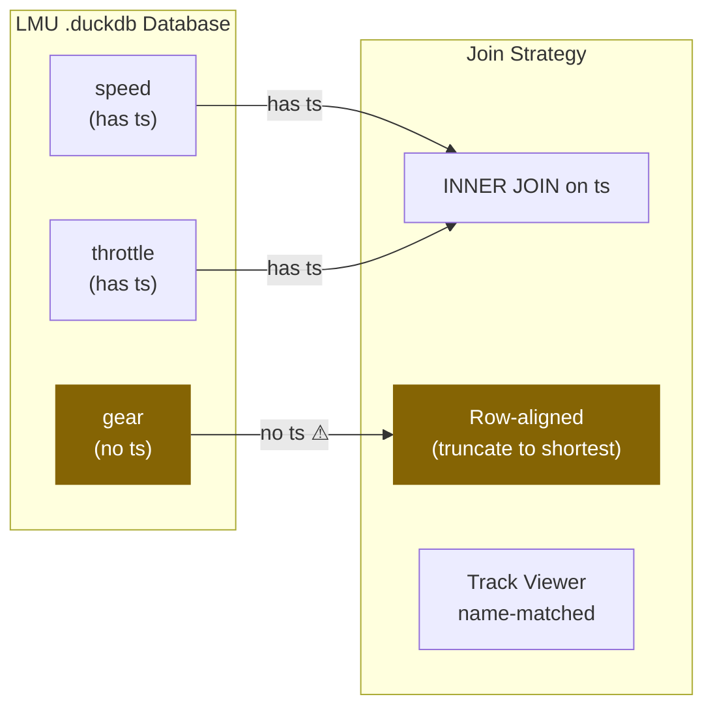
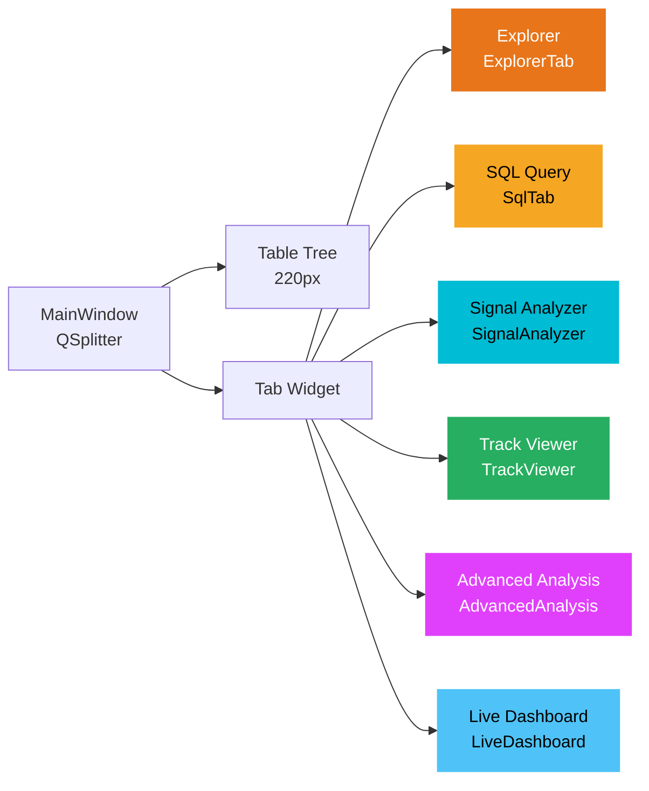
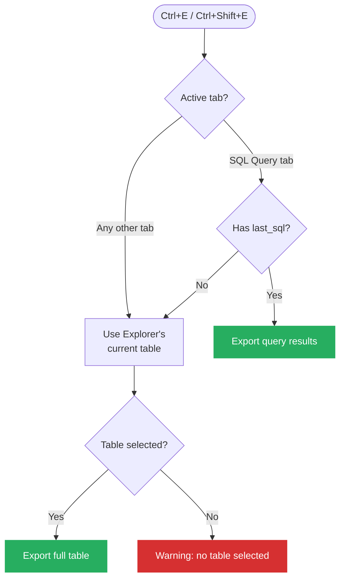

# LMUPI — Le Mans Ultimate Python Interface

LMUPI is a standalone Python desktop application that serves as the primary telemetry analysis tool for Le Mans Ultimate. It reads `.duckdb` telemetry database files, provides interactive exploration of their contents, and exposes a rich set of analysis and visualization tools built on top of DuckDB, NumPy, SciPy, and Matplotlib — all wrapped in a PySide6 Qt GUI.

---

## System Context



---

## Technology Stack

| Library | Version | Role |
|---|---|---|
| **Python** | ≥ 3.13 | Language runtime |
| **PySide6** | ≥ 6.10 | Qt6 GUI framework |
| **DuckDB** | ≥ 1.4 | In-process SQL engine for `.duckdb` files |
| **NumPy** | ≥ 2.4 | Numerical arrays and signal processing primitives |
| **SciPy** | ≥ 1.17 | FFT, cross-correlation, rolling statistics, Spearman r |
| **Matplotlib** | ≥ 3.10 | Embedded plot rendering via Qt backend (`FigureCanvasQTAgg`) |

The project is managed with [uv](https://github.com/astral-sh/uv) and declared in `pyproject.toml`. The entry point script `lmupi` maps to `lmupi.app:run`.

---

## Container Architecture



---

## Project Layout

```
LMUPI/
├── main.py                  # Thin entry point (calls lmupi.app:run)
├── pyproject.toml           # uv project config & dependencies
├── uv.lock                  # Locked dependency tree
├── GUIDE.md                 # End-user keyboard/tab reference
└── lmupi/
    ├── __init__.py          # Empty package marker
    ├── app.py               # MainWindow, run() — application shell
    ├── splitter.py          # Database access layer (all DuckDB calls)
    ├── widgets.py           # Reusable Qt widgets (FilterBar, ExplorerTab, SqlTab)
    ├── analyzer.py          # Signal Analyzer tab (6 plot types)
    ├── advanced.py          # Advanced Analysis tab (4 analysis types)
    ├── track_viewer.py      # Track Viewer tab (GPS map)
    ├── dashboard.py         # Live Dashboard tab (gauges, sparklines, status)
    ├── telemetry_reader.py  # QThread polling LMU shared memory (~60Hz)
    ├── theme.py             # Dark stylesheet, plot color palette, plot theming
    └── sharedmem/           # LMU shared memory layer
        ├── lmu_data.py      # ctypes struct definitions
        ├── lmu_mmap.py      # MMapControl — platform mmap abstraction
        └── lmu_type.py      # Type-annotation stubs for IDE support
```

---

## Module Dependency Graph



!!! info ""
    `splitter.py` is the **only** module that directly calls DuckDB. All other modules go through it.

---

## Application Startup Flow



---

## Opening a Database

Databases reach LMUPI through three paths:



!!! warning "Read-only access"
    All connections opened from `.duckdb` files use `read_only=True`. The database is **never** modified.

---

## Importing CSV / JSON

Importing creates an **in-memory** DuckDB connection, not a file-backed one. Multiple imports in the same session stack into the same in-memory database:



---

## Key Concept: The `ts` Column

The `ts` (timestamp) column is the central axis in LMUPI. LMU telemetry tables record sample time in seconds in a column named `ts`.



- Tables with `ts` are **INNER JOIN**ed when plotting multiple signals with X = `ts`.
- Tables without `ts` are **row-aligned**: fetched independently and truncated to the shortest table.
- In signal trees, tables without `ts` are rendered in **yellow** as a warning.
- The Track Viewer bypasses this entirely — it discovers GPS tables by name pattern.

---

## UI Tabs

LMUPI has six tabs arranged in a `QTabWidget` on the right side of the main splitter:



| Tab | Class | Module | Purpose |
|---|---|---|---|
| **Explorer** | `ExplorerTab` | `widgets.py` | Browse raw table data, schema, stats, filters |
| **SQL Query** | `SqlTab` | `widgets.py` | Run arbitrary DuckDB SQL |
| **Signal Analyzer** | `SignalAnalyzer` | `analyzer.py` | Multi-signal comparison with 6 plot types |
| **Track Viewer** | `TrackViewer` | `track_viewer.py` | 2D GPS track map with colour-by-signal |
| **Advanced Analysis** | `AdvancedAnalysis` | `advanced.py` | Derived signals, lap comparison, FFT, rolling statistics |
| **Live Dashboard** | `LiveDashboard` | `dashboard.py` | Real-time gauges, sparklines, lap info, status indicators |

See [UI & Tabs Reference](ui.md) for per-tab documentation.

---

## Export Routing



---

## Keyboard Shortcuts

| Shortcut | Action |
|---|---|
| `Ctrl+O` | Open `.duckdb` file |
| `Ctrl+E` | Export CSV |
| `Ctrl+Shift+E` | Export JSON |
| `Ctrl+I` | Import CSV |
| `Ctrl+Shift+I` | Import JSON |
| `Ctrl+F` | Focus Explorer filter bar |
| `Ctrl+G` | Switch to Signal Analyzer tab |
| `Ctrl+Return` | Run SQL query (while in SQL tab) |
| `Ctrl+Q` | Quit |

---

## Agent Notes

- The C4 container diagram above is the canonical reference for LMUPI's internal structure
- `splitter.py` is the **sole DuckDB gateway** — never import `duckdb` in other modules
- `TelemetryReader` pushes data to `LiveDashboard` via `push(channel, value)` — new live-data consumers should follow this pattern
- When adding a new tab, create it as a `QWidget` subclass and wire it in `app.py._setup_ui()`
- The shared memory layer is documented in detail at [Shared Memory Overview](../shared-memory/overview.md)
- See [Architecture Overview](../architecture/overview.md) for how LMUPI fits into the broader TeleMU system
