# LMUPI — UI & Tabs Reference

Detailed guide to every tab and UI component in LMUPI.

---

## Application State Machine

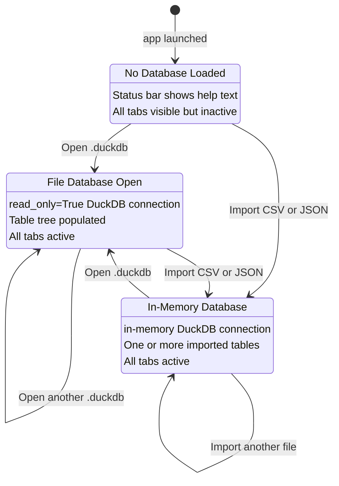

---

## Main Window Layout

```
┌───────────────────────────────────────────────────────────────────┐
│  Menu Bar — File                                                  │
├───────────────────────────────────────────────────────────────────┤
│  Toolbar — Open │ Export CSV │ Export JSON │ Import CSV │         │
│            Import JSON │ Run SQL │ Analyze                        │
├──────────────────┬────────────────────────────────────────────────┤
│  Table Tree      │  Tab Widget                                    │
│  (220 px)        │  Explorer │ SQL Query │ Signal Analyzer │      │
│                  │  Track Viewer │ Advanced Analysis              │
│  Filename.duckdb │                                                │
│  ├ speed (12 300)│  [Active tab content]                          │
│  ├ throttle      │                                                │
│  ├ brake         │                                                │
│  └ latitude      │                                                │
├──────────────────┴────────────────────────────────────────────────┤
│  Status Bar — filename.duckdb — 42 tables                         │
└───────────────────────────────────────────────────────────────────┘
```

The main splitter defaults to 220px for the table tree and the remainder for the tab widget. Both panes can be resized by dragging the splitter handle (highlighted in accent orange on hover).

### Table Tree interaction

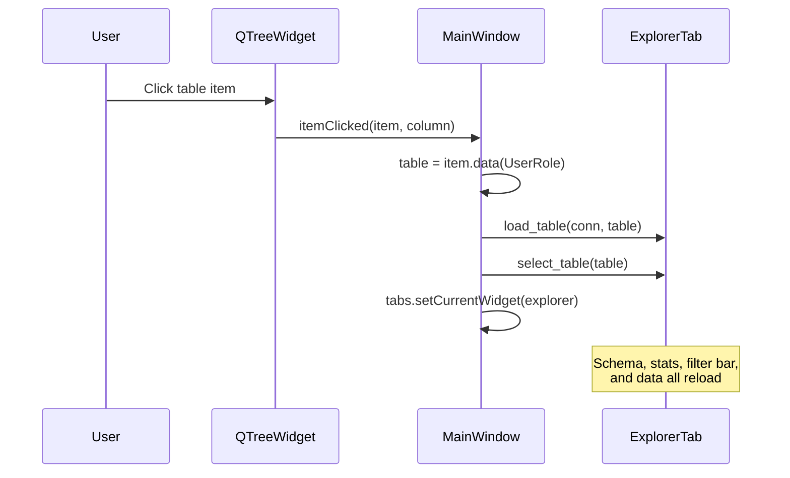

---

## Tab 1 — Explorer

**Class:** `ExplorerTab` (`widgets.py`)

```
┌─────────────────────────────────────┐  ┌────────────┐
│  Table ▾  speed                     │  │  Rows ▾ 100│
└─────────────────────────────────────┘  └────────────┘
┌──────────────────────────────────────────────────────┐
│  Schema  │  Statistics                               │
│──────────┼────────────────────────────────────────── │
│  Column  │  Type    │  Nullable                      │
│  ts      │  DOUBLE  │  NO                            │
│  value   │  FLOAT   │  YES                           │
└──────────────────────────────────────────────────────┘
┌────────────────────────────────────────────┐  ┌──────┐
│  [ ts...filter ] [ value...filter ] [ ... ]│  │Clear │
└────────────────────────────────────────────┘  └──────┘
┌──────────────────────────────────────────────────────┐
│  ts      │  value                                    │
│  0.000   │  87.4                                     │
│  0.016   │  88.1                                     │
│  0.032   │  88.7                                     │
│  ...     │  ...                                      │
└──────────────────────────────────────────────────────┘
```

### Filter pipeline

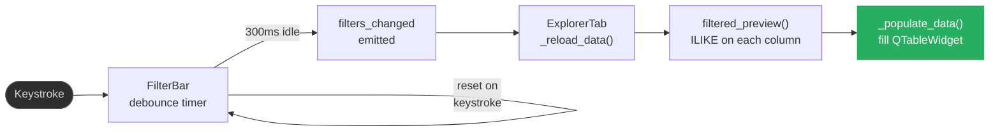

### Controls

| Control | Behavior |
|---|---|
| **Table dropdown** | Switches the active table; triggers a full reload |
| **Rows dropdown** | Limits preview to 100 / 500 / 1,000 rows, or All |
| **Schema sub-tab** | Shows column name, DuckDB type, and nullability |
| **Statistics sub-tab** | Shows min, max, avg (numeric only), and null count per column |
| **Filter bar** | One `QLineEdit` per column — text is matched as `%input%` using `ILIKE` |
| **Clear button** | Resets all filters and re-fetches unfiltered data |

!!! tip "Shortcut"
    `Ctrl+F` switches to Explorer and focuses the first filter input from anywhere in the application.

---

## Tab 2 — SQL Query

**Class:** `SqlTab` (`widgets.py`)

```
┌──────────────────────────────────────────────────────┐
│  SELECT ts, value FROM speed                         │
│  WHERE ts BETWEEN 50 AND 100                         │
│  (monospace editor, max 160 px tall)                 │
└──────────────────────────────────────────────────────┘
[ Run (Ctrl+Return) ]   10 rows in 0.003s
┌──────────────────────────────────────────────────────┐
│  ts      │  value                                    │
│  50.000  │  142.3                                    │
│  50.016  │  143.1                                    │
│  ...     │  ...                                      │
└──────────────────────────────────────────────────────┘
```

### Query execution flow

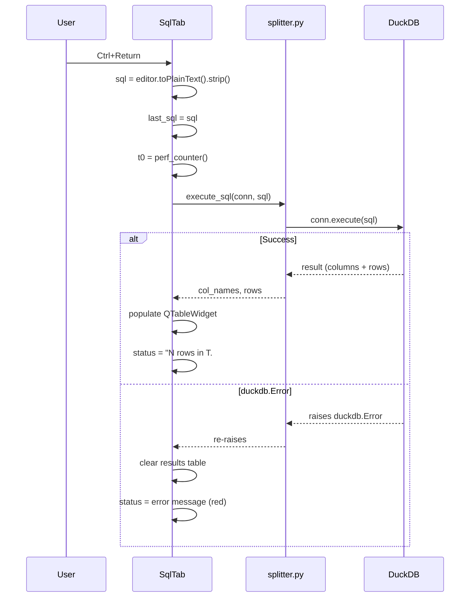

### Export integration

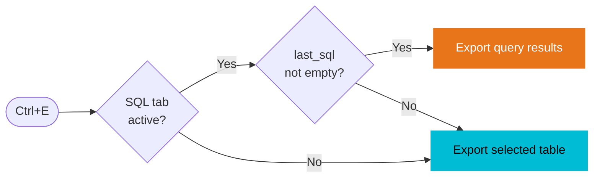

### Example queries

```sql
-- Time-windowed slice
SELECT ts, value FROM throttle WHERE ts BETWEEN 50 AND 100

-- Peak values per signal
SELECT MAX(value) AS peak_speed FROM speed

-- Join two signals manually
SELECT s.ts, s.value AS speed, t.value AS throttle
FROM speed s INNER JOIN throttle t ON s.ts = t.ts

-- Lap segment average
SELECT AVG(value) FROM speed WHERE ts > 120 AND ts < 185
```

---

## Tab 3 — Signal Analyzer

**Class:** `SignalAnalyzer` (`analyzer.py`)

### Signal selection tree

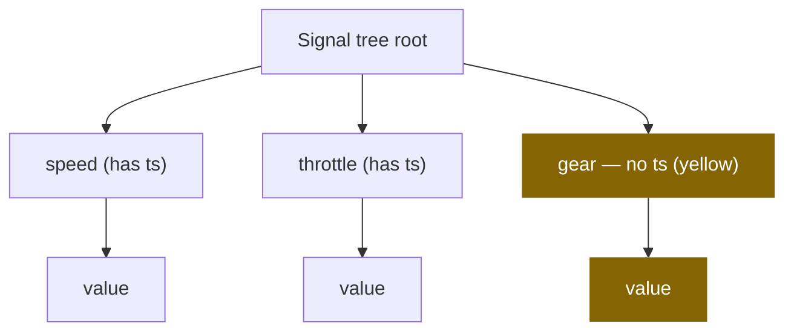

Tables without `ts` are shown in yellow — they can still be plotted, but only via row-alignment, not time-joining.

### X axis mode decision

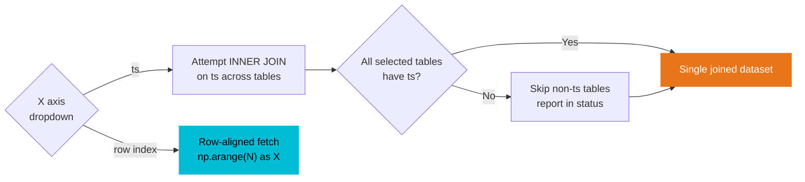

### Filter composition

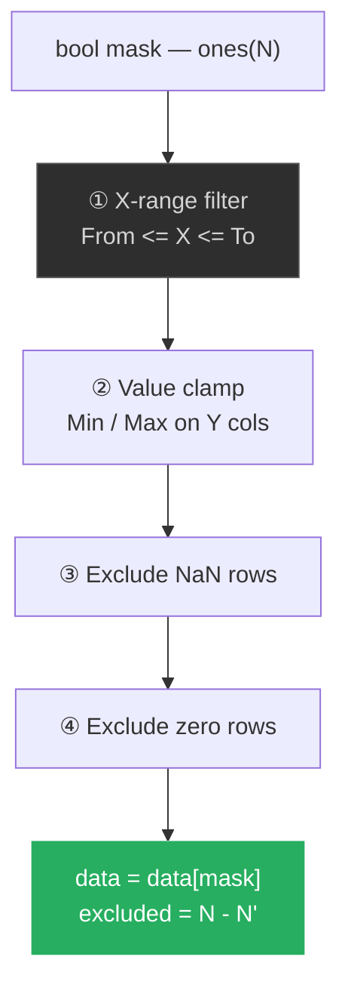

### Plot type guide

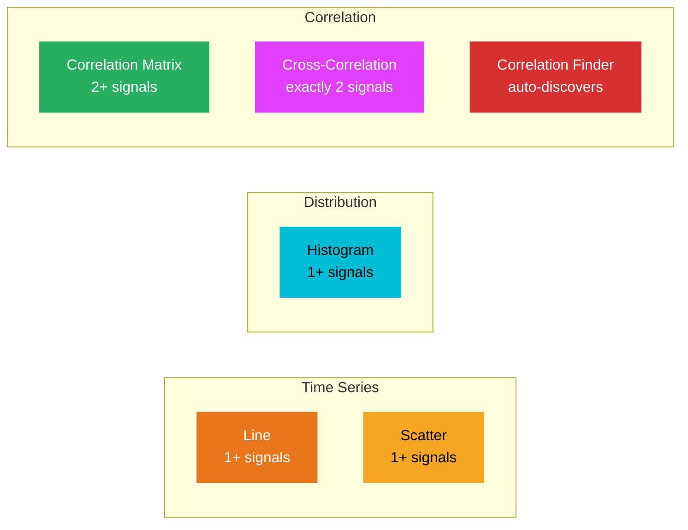

| Plot type | Signals needed | Use when |
|---|---|---|
| **Line** | 1+ | Time-series comparison; dual Y-axis for 2 signals with very different ranges |
| **Scatter** | 1+ | Revealing point clouds and non-temporal relationships |
| **Histogram** | 1+ | Comparing value distributions across signals |
| **Correlation Matrix** | 2+ | Finding pairwise linear relationships at a glance |
| **Cross-Correlation** | Exactly 2 | Measuring time delays between two signals |
| **Correlation Finder** | None | Automatic discovery of top correlations across all tables |

### Dual Y-axis logic (Line plot)

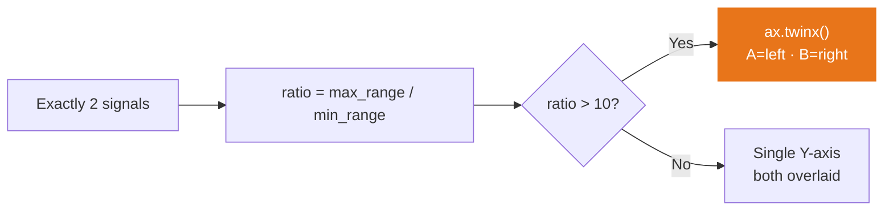

---

## Tab 4 — Track Viewer

**Class:** `TrackViewer` (`track_viewer.py`)

### GPS name matching

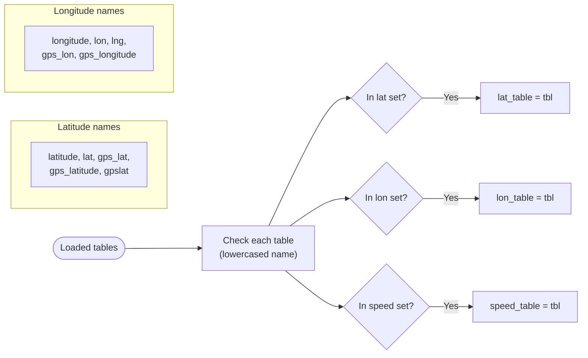

### Colour-by overlay rendering

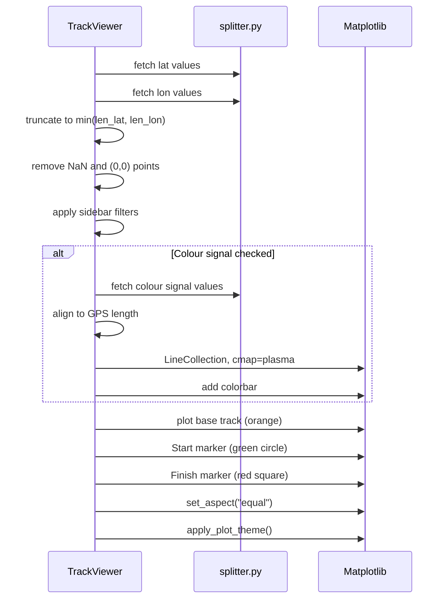

### Track rendering data flow

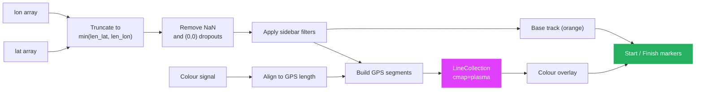

!!! tip
    Use **Exclude zeros** to remove GPS dropout points that appear as (0, 0) coordinates.

---

## Tab 5 — Advanced Analysis

**Class:** `AdvancedAnalysis` (`advanced.py`)

### Control panel switching

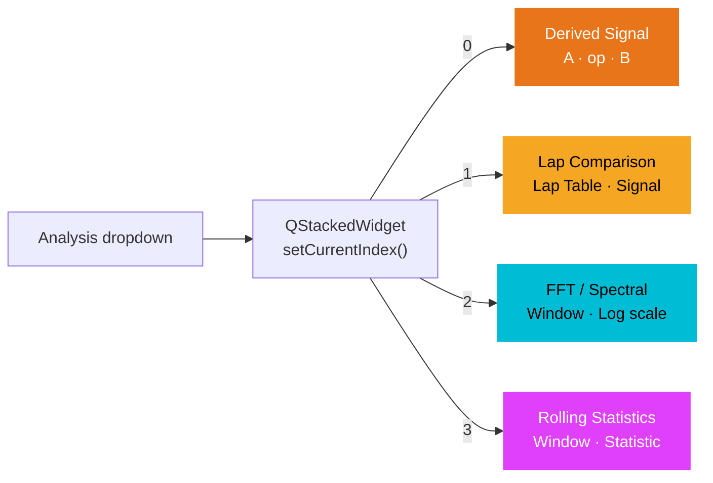

### Derived Signal — operator reference

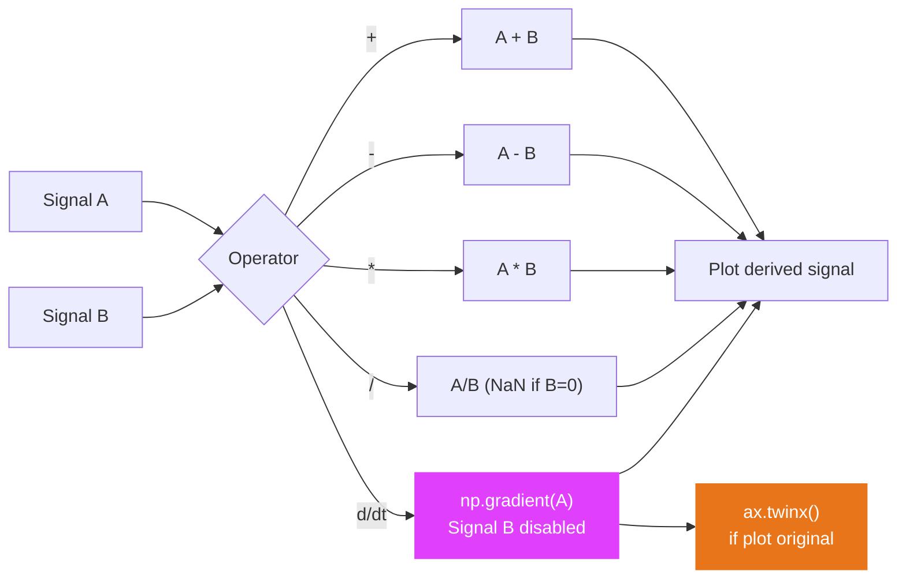

### Lap Comparison — workflow

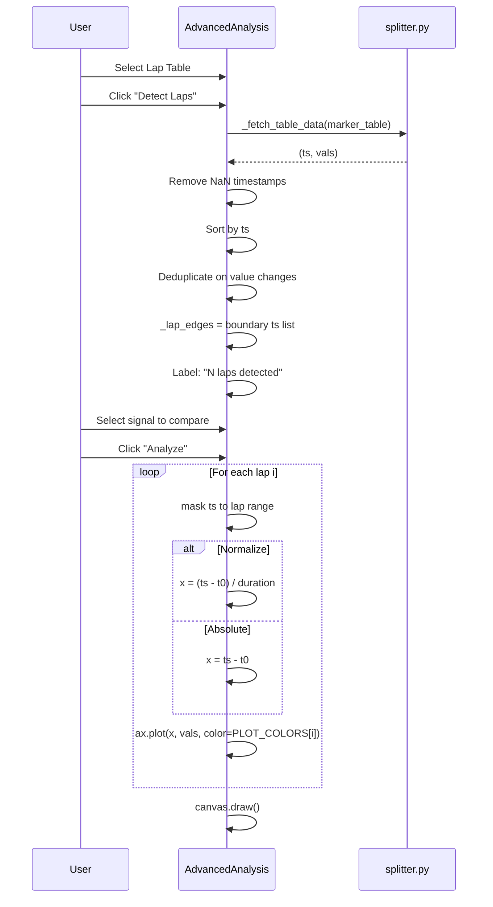

### FFT — window function comparison

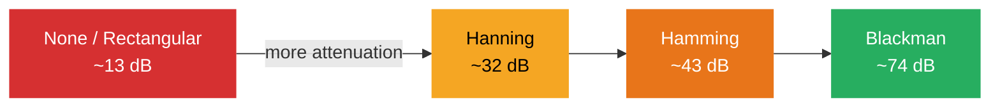

| Window | Sidelobe attenuation | Amplitude accuracy | Best for |
|---|---|---|---|
| **None** | ~13 dB | Highest | Sharp edges, known periodic signals |
| **Hanning** | ~32 dB | Good | General purpose (recommended default) |
| **Hamming** | ~43 dB | Good | Slightly better sidelobe than Hanning |
| **Blackman** | ~74 dB | Lower | Maximum leakage suppression |

### Rolling Statistics — visual effect guide

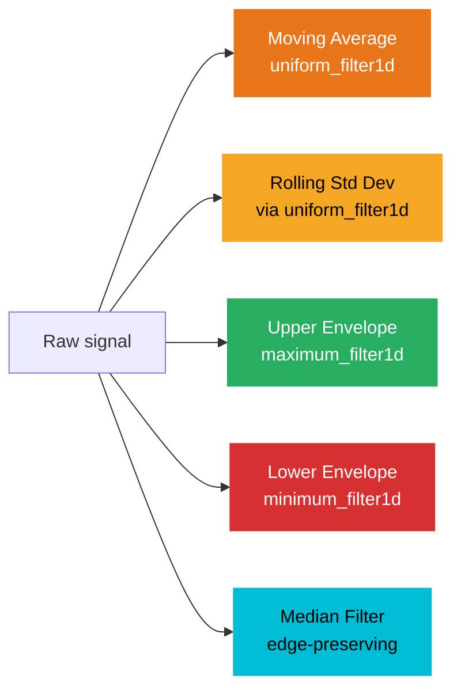

!!! warning "Window size is in samples, not seconds"
    At 60 Hz data, a window of 60 covers 1 second. At 100 Hz, you need a window of 100 for 1 second of smoothing.

---

## Keyboard Shortcuts Reference

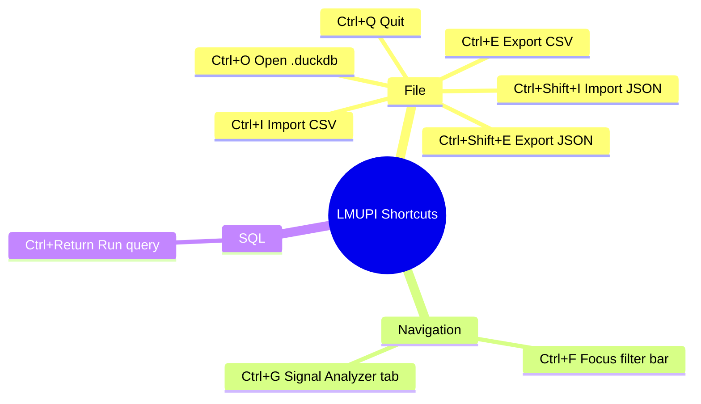
