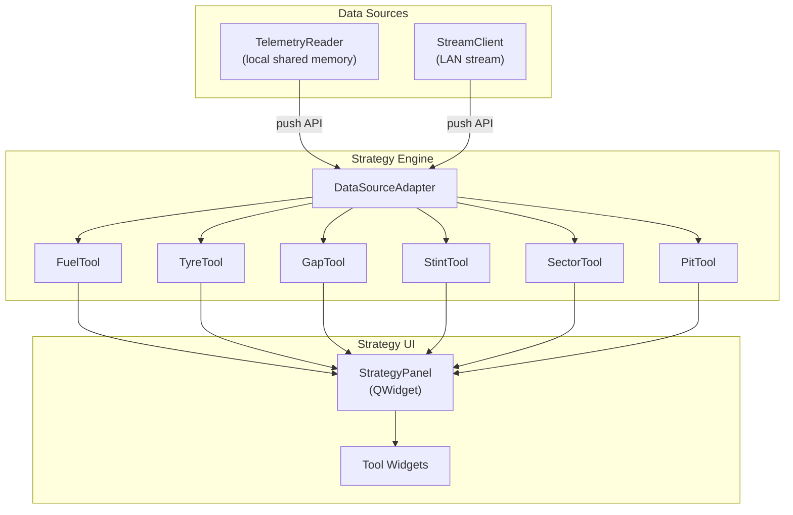
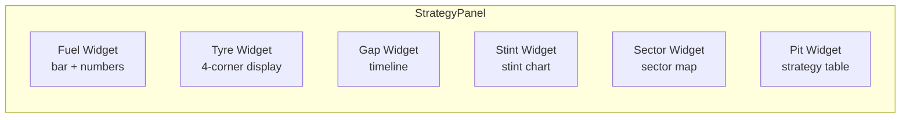
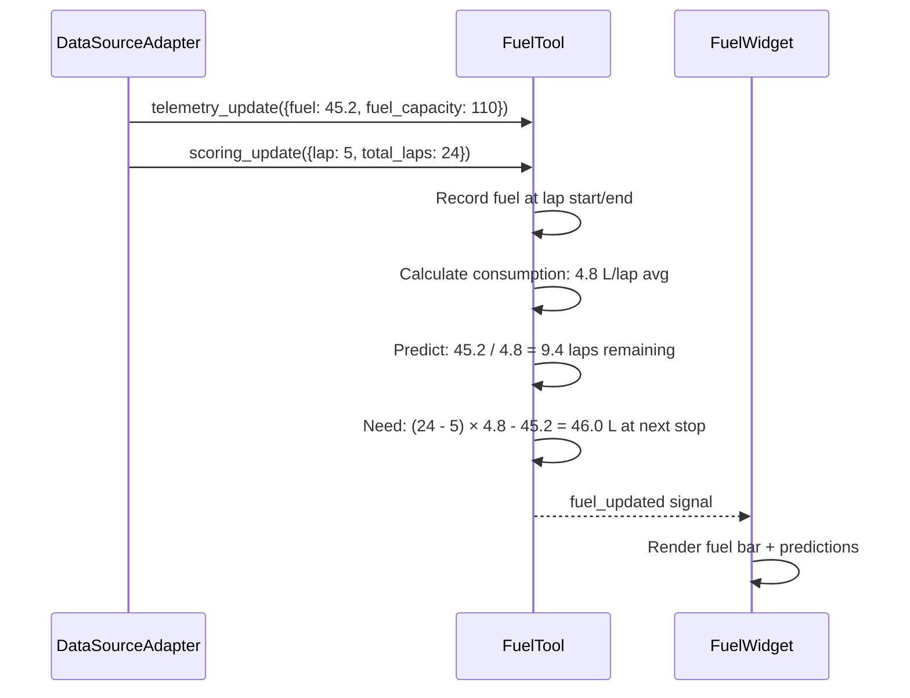

# Race Engineer Overview

!!! warning "Planned Feature"
    The race engineer / strategy engine is not yet implemented. This document specifies the design.

The race engineer subsystem provides real-time strategy tools for monitoring fuel, tyres, gaps, stints, and pit timing. It runs on the engineer's PC, consuming telemetry from the streaming subsystem (or locally from shared memory).

## Architecture



## Data Source Abstraction

The strategy engine doesn't care where telemetry comes from. A `DataSourceAdapter` normalises both local and streamed data into a common interface:

```python
class DataSourceAdapter(QObject):
    """Unified interface for strategy tools"""

    # Emitted whenever new data arrives (from any source)
    telemetry_update = Signal(dict)   # {channel: value, ...}
    scoring_update = Signal(dict)     # {lap, sector, position, ...}
    session_update = Signal(dict)     # {track, weather, ...}

    def connect_local(self, reader: TelemetryReader) -> None: ...
    def connect_stream(self, client: StreamClient) -> None: ...
```

## Strategy Tools

Each tool is a self-contained class that:

1. Receives updates from the adapter
2. Maintains internal state (history, predictions)
3. Exposes results to the UI via properties and signals

| Tool | Purpose | Key Outputs |
|------|---------|-------------|
| **FuelTool** | Fuel consumption tracking & prediction | Laps remaining, fuel to add at pit, consumption per lap |
| **TyreTool** | Tyre degradation monitoring | Temp trends, wear estimates, optimal pit window |
| **GapTool** | Gap tracking to cars ahead/behind | Gap trends, undercut/overcut windows |
| **StintTool** | Stint management | Stint length, avg pace, degradation curve |
| **SectorTool** | Sector-by-sector analysis | Sector deltas, mini-sectors, weak areas |
| **PitTool** | Pit stop timing | Pit window calculator, time lost in pits, strategy comparison |

See [Tool Specs](tools.md) for detailed specifications of each tool.

## UI Integration

The strategy tools are presented in a `StrategyPanel` — either as a new tab or as an overlay on the LiveDashboard.



### Design Guidelines

- Each tool widget is a QWidget that can be shown/hidden independently
- Use QPainter for custom visualisations (consistent with dashboard gauges)
- Strategy data updates at a lower frequency than raw telemetry (once per sector or lap)
- Historical data is kept in memory for the current session; persistence is handled by the recording subsystem

## Data Flow Example: Fuel Calculation



## Agent Notes

- **Files to create**: `LMUPI/lmupi/strategy/` package with `__init__.py`, `adapter.py`, `fuel.py`, `tyres.py`, `gaps.py`, `stint.py`, `sector.py`, `pit.py`, plus `LMUPI/lmupi/strategy_panel.py` for UI
- **Files to modify**: `app.py` (add strategy tab or panel), `dashboard.py` (optional overlay mode)
- **Pattern**: each tool is a QObject with signals; the panel connects tool signals to widget updates
- **Data source**: the adapter consumes the same push API as the dashboard — no new data path needed
- **Testing**: unit test each tool with mock telemetry sequences; verify predictions against known scenarios
- **Dependencies**: no new packages needed (NumPy already available for calculations)
- **Related issues**: check project tracker for race engineer and strategy issues
