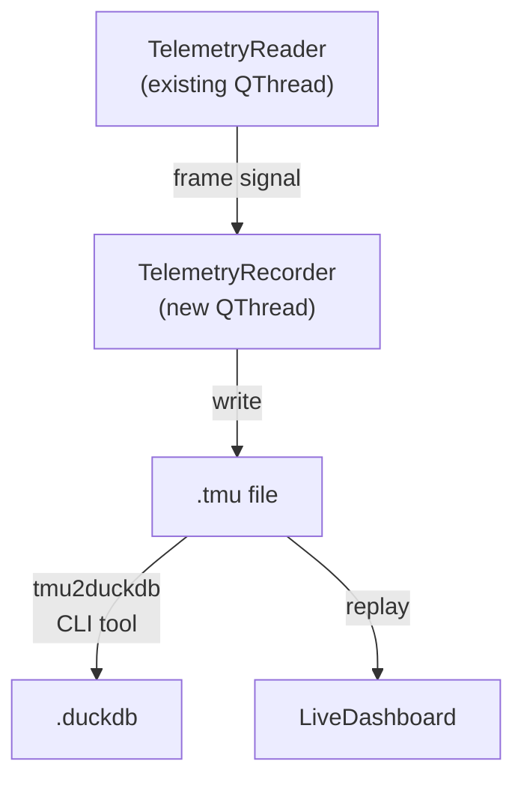
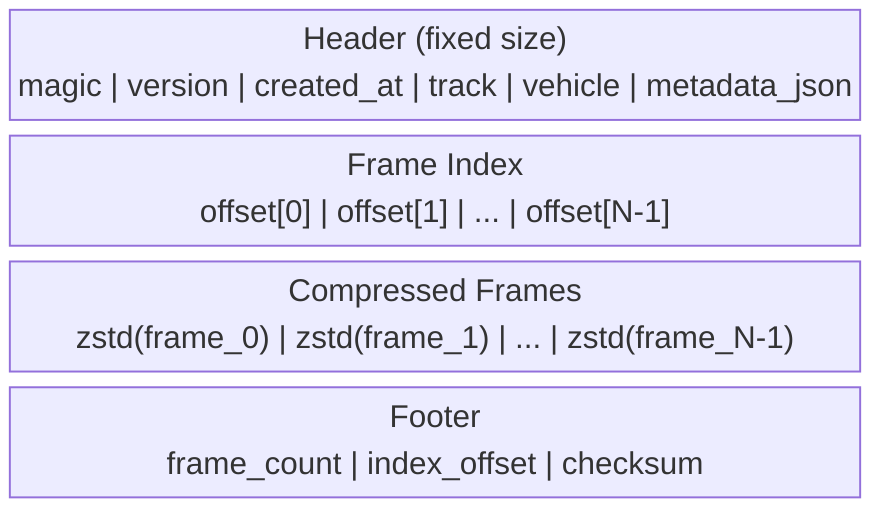
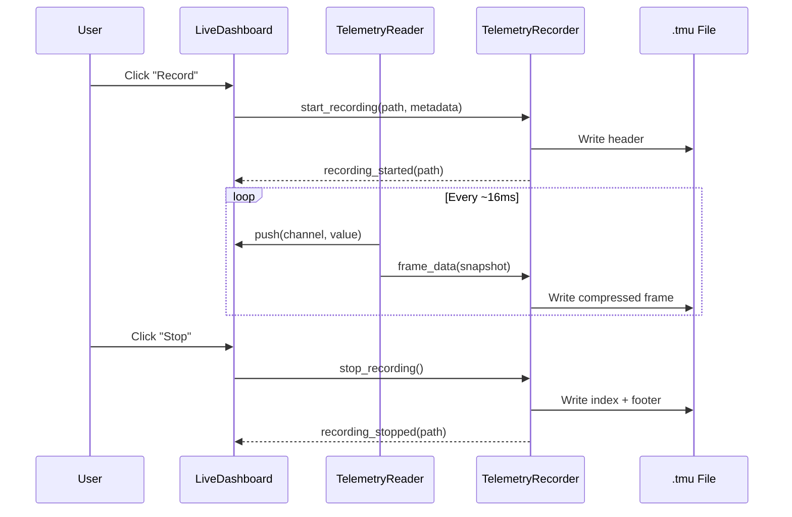

# Recording Overview

!!! warning "Planned Feature"
    Session recording is not yet implemented. This document specifies the design for agent implementation.

The recording subsystem captures live telemetry from shared memory into `.tmu` files. These files can be replayed in the dashboard or converted to `.duckdb` for post-session analysis.

## Architecture



## TelemetryRecorder Design

`TelemetryRecorder` is a QThread that receives frame data from `TelemetryReader` and writes it to a `.tmu` file.

### Class Interface

```python
class TelemetryRecorder(QThread):
    """Records telemetry frames to .tmu files"""

    # Signals
    recording_started = Signal(str)   # emits file path
    recording_stopped = Signal(str)   # emits file path
    error = Signal(str)               # emits error message
    frames_written = Signal(int)      # emits frame count (periodic)

    def start_recording(self, output_path: str, metadata: dict) -> None: ...
    def stop_recording(self) -> None: ...
    def is_recording(self) -> bool: ...
```

### Integration with TelemetryReader

The recorder connects to the same data path as the dashboard:

```python
# In app.py or dashboard.py
reader = TelemetryReader(dashboard)
recorder = TelemetryRecorder()

# TelemetryReader emits frame data; recorder consumes it
reader.frame_data.connect(recorder.on_frame)
```

The `frame_data` signal (to be added to `TelemetryReader`) emits the raw struct snapshot each poll cycle.

## .tmu File Format

Binary file with header, frame index, and compressed frame data.

### Layout



### Header Fields

| Field | Type | Size | Description |
|-------|------|------|-------------|
| `magic` | bytes | 4 | `b"TMU\x01"` |
| `version` | uint16 | 2 | Format version (starts at 1) |
| `created_at` | float64 | 8 | Unix timestamp |
| `track_name` | char[64] | 64 | Track name from scoring |
| `vehicle_name` | char[64] | 64 | Vehicle name from telemetry |
| `session_type` | uint8 | 1 | Session type from `mSession` |
| `metadata_len` | uint32 | 4 | Length of JSON metadata |
| `metadata` | bytes | variable | UTF-8 JSON (driver name, weather, etc.) |

### Frame Format

Each frame is independently zstd-compressed:

| Field | Type | Description |
|-------|------|-------------|
| `timestamp` | float64 | `mElapsedTime` from telemetry |
| `telemetry` | bytes | Serialised `LMUVehicleTelemetry` for player vehicle |
| `scoring` | bytes | Serialised `LMUVehicleScoring` for player vehicle |

### Footer

| Field | Type | Description |
|-------|------|-------------|
| `frame_count` | uint64 | Total frames written |
| `index_offset` | uint64 | Byte offset where frame index starts |
| `checksum` | uint32 | CRC32 of header + index + frames |

### Design Rationale

- **Per-frame compression**: allows random access to any frame without decompressing the entire file
- **Frame index**: enables seeking to any point in the recording by timestamp
- **zstd**: fast compression/decompression, good ratio for telemetry data
- **Player-only**: records only the player's vehicle data (not all 104 vehicles) to keep file sizes small

## Data Flow



## Agent Notes

- **Files to create**: `LMUPI/lmupi/recorder.py`
- **Files to modify**: `telemetry_reader.py` (add `frame_data` signal), `dashboard.py` (add record/stop buttons), `app.py` (wire recorder)
- **Pattern**: follow the QThread pattern from `TelemetryReader` — init on main thread, work on QThread
- **Dependencies**: `zstandard` package (add to `pyproject.toml`)
- **Testing**: create a small `.tmu` file from mock data, verify header parsing, verify frame random access
- **UI**: add Record/Stop toggle button to the `LiveDashboard` toolbar
- **Related issues**: check project tracker for recording-related issues
