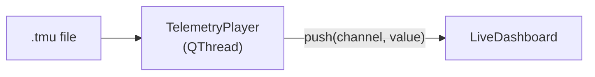
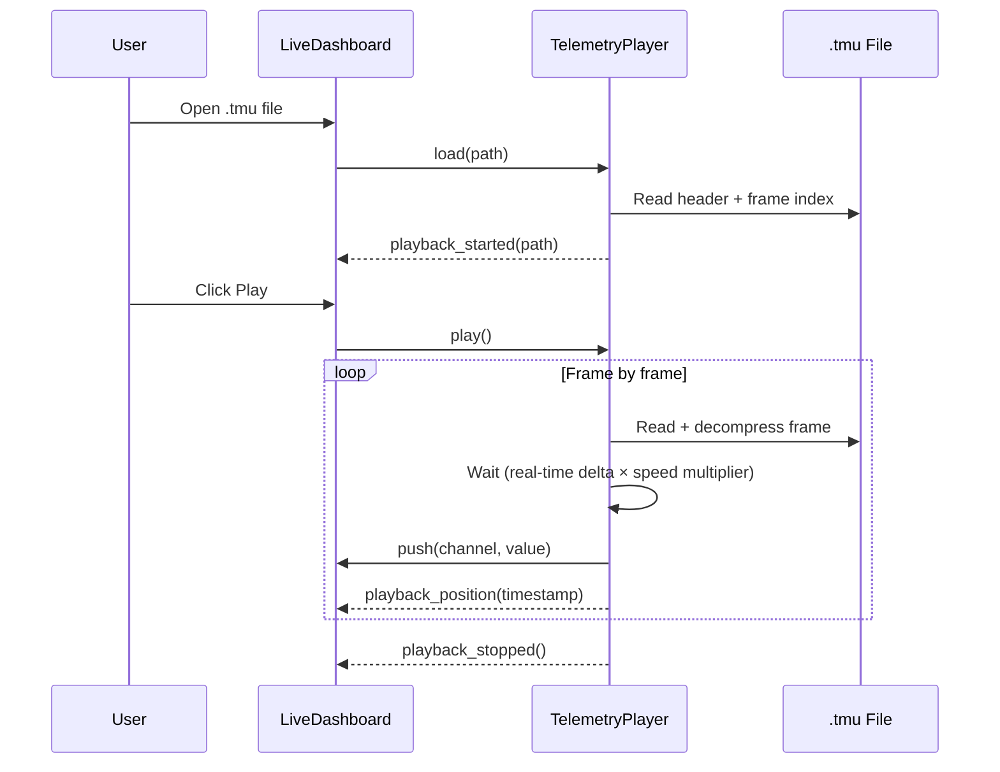
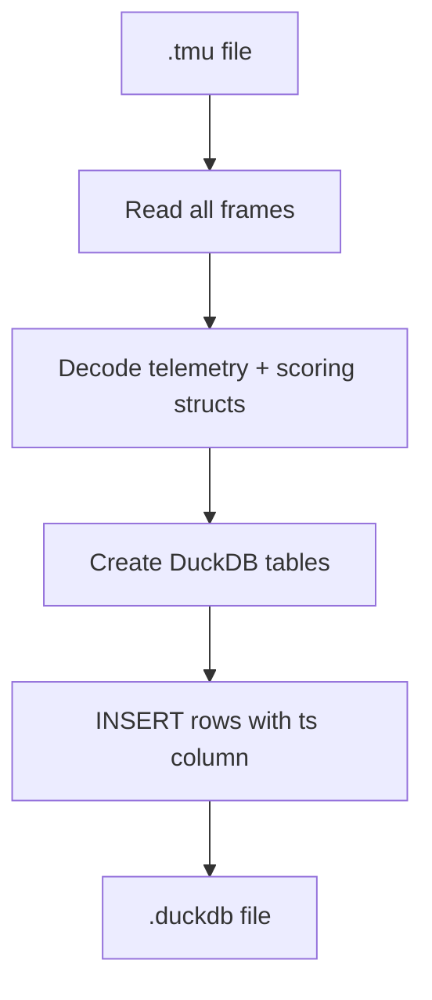

# Playback & Conversion

!!! warning "Planned Feature"
    Playback and conversion are not yet implemented. This document specifies the design.

## Playback

`.tmu` files can be replayed through the LiveDashboard, simulating a live session from recorded data.

### Playback Architecture



### TelemetryPlayer Design

```python
class TelemetryPlayer(QThread):
    """Replays .tmu files through the dashboard"""

    # Signals
    playback_started = Signal(str)     # file path
    playback_stopped = Signal()
    playback_position = Signal(float)  # current timestamp
    error = Signal(str)

    def load(self, tmu_path: str) -> None: ...
    def play(self) -> None: ...
    def pause(self) -> None: ...
    def seek(self, timestamp: float) -> None: ...
    def set_speed(self, multiplier: float) -> None: ...  # 0.5x, 1x, 2x, 4x
```

### Playback Flow



### Seeking

The frame index in the `.tmu` footer enables efficient seeking:

1. Binary search the frame index for the target timestamp
2. Seek to the frame offset
3. Decompress and push that frame
4. Resume playback from that point

## .tmu → DuckDB Conversion

A CLI tool converts `.tmu` recordings into `.duckdb` files compatible with the existing post-session analysis tabs.

### Usage

```bash
uv run tmu2duckdb recording.tmu --output session.duckdb
```

### Conversion Process



### Table Mapping

The converter creates tables that match what `splitter.py` expects:

| DuckDB Table | Source | Key Columns |
|-------------|--------|-------------|
| `telemetry` | `LMUVehicleTelemetry` fields | `ts`, speed, rpm, throttle, brake, gear, steering, fuel |
| `tyres` | `LMUWheel[4]` fields | `ts`, temp_fl/fr/rl/rr, pressure_fl/fr/rl/rr, wear_fl/fr/rl/rr |
| `scoring` | `LMUVehicleScoring` fields | `ts`, lap, sector, position, lap_time, sector_times |
| `weather` | `LMUScoringInfo` weather fields | `ts`, ambient_temp, track_temp, rain, wetness |
| `session_info` | Header metadata | track, vehicle, session_type (single row) |

The `ts` column uses `mElapsedTime` from each frame, enabling INNER JOIN across tables — matching the existing splitter pattern.

### CLI Entry Point

```python
# In pyproject.toml [project.scripts]
tmu2duckdb = "lmupi.tmu_convert:main"
```

## Agent Notes

- **Files to create**: `LMUPI/lmupi/player.py` (TelemetryPlayer), `LMUPI/lmupi/tmu_convert.py` (CLI converter)
- **Files to modify**: `dashboard.py` (add playback controls, file open), `app.py` (wire player)
- **Pattern**: `TelemetryPlayer` uses the same push API as `TelemetryReader` — the dashboard doesn't need to know the data source
- **DuckDB schema**: the converter must produce tables with a `ts` column so `splitter.py` can JOIN them
- **Dependencies**: `zstandard` (shared with recorder)
- **Testing**: round-trip test — record mock data → save .tmu → convert to .duckdb → verify with splitter queries
- **Related issues**: check project tracker for playback and conversion issues
