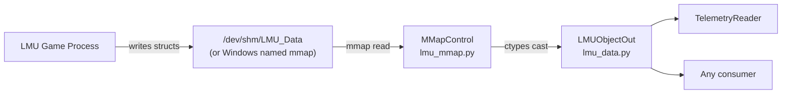
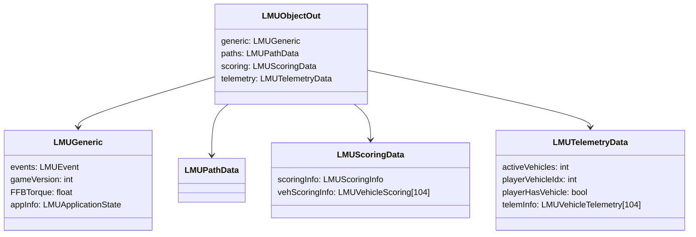

# Shared Memory Overview

TeleMU reads live telemetry from Le Mans Ultimate via its shared memory interface. The `sharedmem/` package provides a Python mapping of LMU's C++ `SharedMemoryInterface.hpp` using ctypes, plus a cross-platform mmap abstraction.

## Architecture



## Module Layout

```
LMUPI/lmupi/sharedmem/
├── lmu_data.py   # ctypes struct definitions (mirrors SharedMemoryInterface.hpp)
├── lmu_mmap.py   # MMapControl — platform mmap open/read/close
└── lmu_type.py   # Type-annotation stubs for IDE support
```

## MMapControl

`MMapControl` is the main entry point for reading shared memory. It handles platform differences and provides two access modes.

### Usage

```python
from lmupi.sharedmem.lmu_mmap import MMapControl
from lmupi.sharedmem.lmu_data import LMUObjectOut

ctrl = MMapControl("LMU_Data", LMUObjectOut)
ctrl.create(access_mode=0)  # 0 = copy, 1 = direct

# Poll loop
ctrl.update()  # snapshots buffer (copy mode)
speed_x = ctrl.data.telemetry.telemInfo[0].mLocalVel.x
```

### Access Modes

| Mode | Value | Behaviour | Use Case |
|------|-------|-----------|----------|
| **Copy** | `0` | Snapshots buffer on `update()` only when scoring + telemetry flags are active and vehicle counts match | Thread-safe polling from QThread |
| **Direct** | `1` | `data` points directly at the mmap buffer; `update()` is a no-op | Quick reads, debugging |

### Data Gating (Copy Mode)

In copy mode, `update()` only copies the buffer when **all** of these conditions are met:

1. `SME_UPDATE_SCORING` event flag is set
2. `SME_UPDATE_TELEMETRY` event flag is set
3. `scoring.scoringInfo.mNumVehicles == telemetry.activeVehicles`

This ensures the snapshot is internally consistent — scoring and telemetry data refer to the same set of vehicles.

### Platform Differences

| Platform | Mechanism |
|----------|-----------|
| **Windows** | `mmap.mmap(-1, size, "LMU_Data")` — named shared memory |
| **Linux** | Opens `/dev/shm/LMU_Data` as a file, initialises with zeros if empty, then `mmap.mmap(file.fileno(), size)` |

### Lifecycle

```mermaid
statechart
    [*] --> Created: MMapControl(name, struct)
    Created --> Active: create(access_mode)
    Active --> Active: update() [poll loop]
    Active --> Closed: close()
    Closed --> [*]
```

1. **`__init__`** — stores name and struct type, no mmap yet
2. **`create(mode)`** — opens mmap, creates initial buffer, assigns `update` method
3. **`update()`** — called in a loop; snapshots buffer (copy) or no-op (direct)
4. **`close()`** — makes a final `from_buffer_copy`, closes mmap, nulls `update`

## Root Data Structure

The mmap buffer is cast to `LMUObjectOut`, which contains four top-level sections:



See [Data Structures](data-structures.md) for the complete field reference.

## Agent Notes

- **Files**: `LMUPI/lmupi/sharedmem/lmu_data.py`, `lmu_mmap.py`, `lmu_type.py`
- **Pattern**: always use `MMapControl` — never open `/dev/shm/` directly
- **Thread safety**: use copy mode (`access_mode=0`) when reading from a QThread
- **Adding fields**: if LMU updates its shared memory struct, update `lmu_data.py` first, then `lmu_type.py` for IDE annotations
- **Testing**: `lmu_mmap.py` has a `test_api()` function at the bottom that exercises both modes
- **Constant**: `LMUConstants.MAX_MAPPED_VEHICLES = 104` — all vehicle arrays are this size
