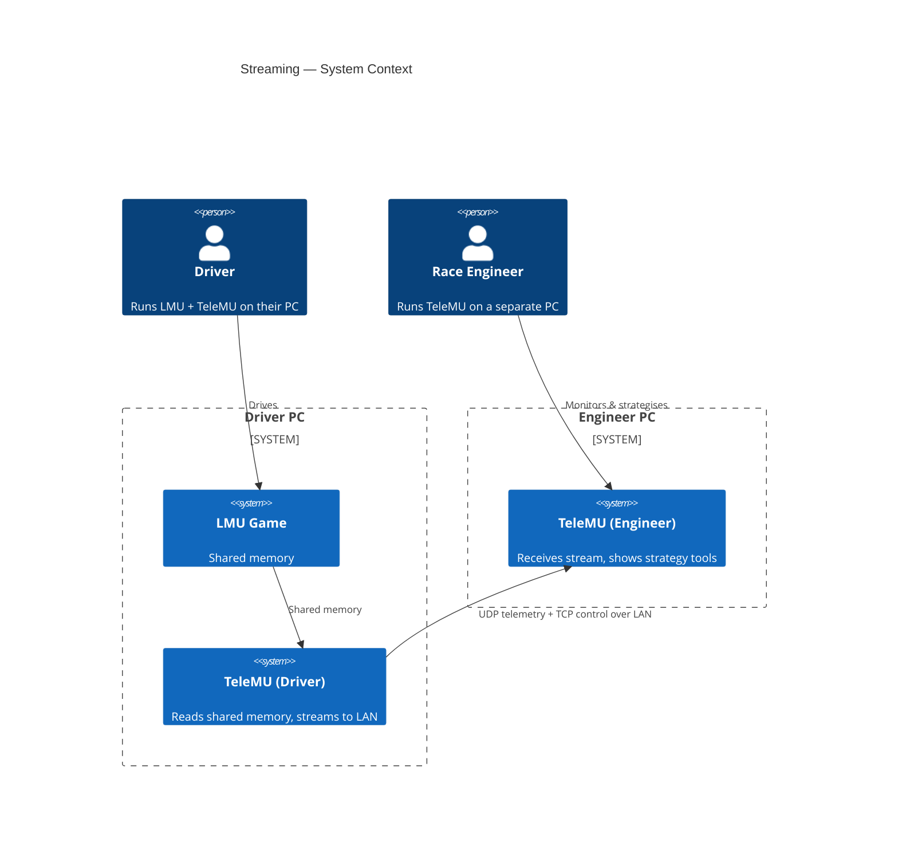
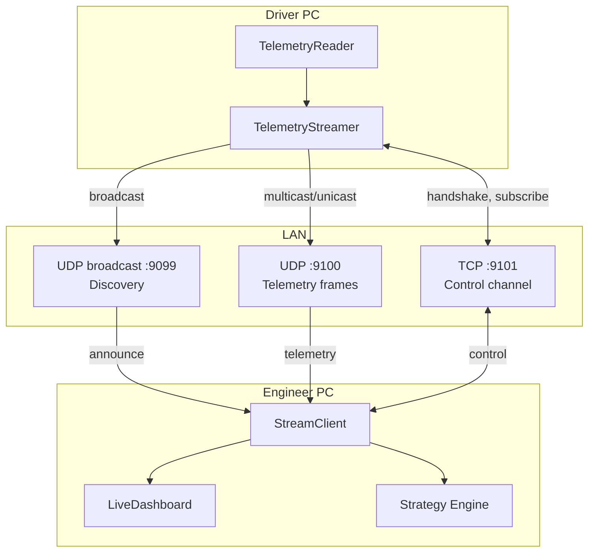
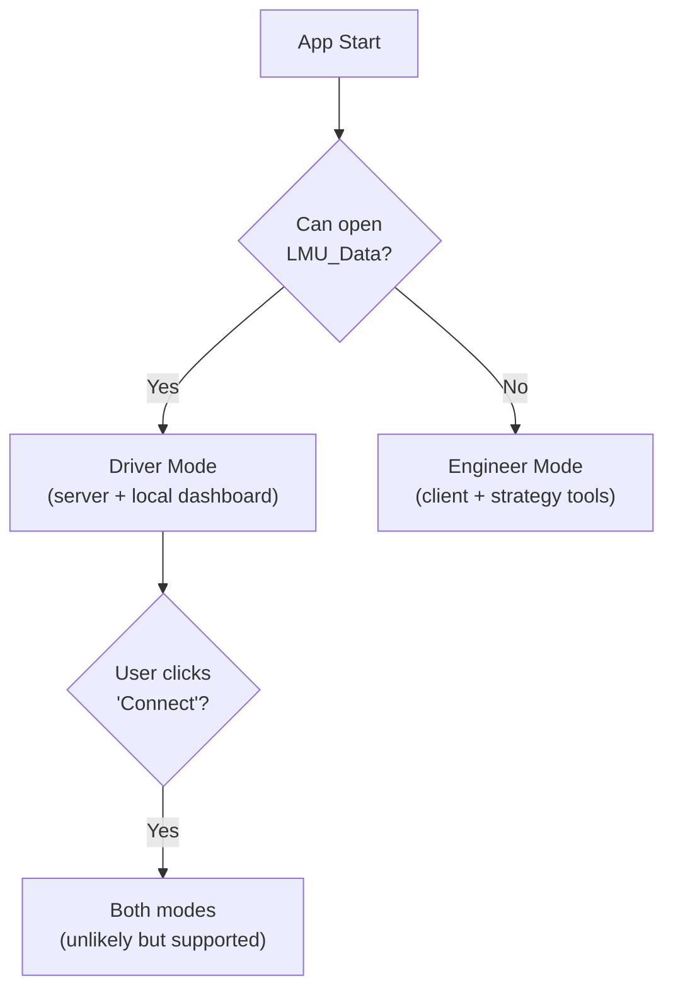

# Streaming Overview

!!! warning "Planned Feature"
    LAN streaming is not yet implemented. This document specifies the design.

The streaming subsystem sends live telemetry from the driver's PC to one or more race engineer PCs over the local network.

## System Context



## Network Architecture



## Roles

### Driver Mode (Server)

The driver's TeleMU instance acts as the streaming server:

- `TelemetryStreamer` receives frame data from `TelemetryReader` (same signal as recorder)
- Broadcasts discovery announcements on UDP port 9099
- Accepts TCP control connections on port 9101
- Sends telemetry frames on UDP port 9100

### Engineer Mode (Client)

The engineer's TeleMU instance acts as a streaming client:

- `StreamClient` listens for discovery broadcasts to find available drivers
- Connects via TCP for handshake and control
- Receives UDP telemetry frames
- Feeds data into `LiveDashboard` and `Strategy Engine` using the same push API

### Automatic Role Detection

TeleMU detects its role based on shared memory availability:



## Design Principles

1. **UDP for telemetry** — low latency, tolerates packet loss (frames are independent)
2. **TCP for control** — reliable delivery for handshake, subscribe, session info
3. **Broadcast discovery** — zero-configuration on LAN
4. **Multi-client** — one driver can stream to multiple engineers
5. **Same push API** — engineer's dashboard uses the same `push(channel, value)` interface as local mode

## Components

### TelemetryStreamer (Driver Side)

```python
class TelemetryStreamer(QThread):
    """Streams telemetry to LAN clients"""

    client_connected = Signal(str)     # client address
    client_disconnected = Signal(str)
    error = Signal(str)

    def start_streaming(self) -> None: ...
    def stop_streaming(self) -> None: ...
    def connected_clients(self) -> list[str]: ...
```

### StreamClient (Engineer Side)

```python
class StreamClient(QThread):
    """Receives telemetry stream from a driver"""

    connected = Signal(str)         # driver address
    disconnected = Signal()
    frame_received = Signal(object) # decoded frame
    error = Signal(str)

    def discover(self) -> list[dict]: ...  # find drivers on LAN
    def connect_to(self, address: str) -> None: ...
    def disconnect(self) -> None: ...
```

## Agent Notes

- **Files to create**: `LMUPI/lmupi/streamer.py` (TelemetryStreamer), `LMUPI/lmupi/stream_client.py` (StreamClient)
- **Files to modify**: `telemetry_reader.py` (add `frame_data` signal if not already added for recorder), `dashboard.py` (add connect UI), `app.py` (role detection, wire streamer or client)
- **Pattern**: QThread for both server and client; use Qt's socket classes or Python's `socket` + `select`
- **Protocol**: see [Protocol Spec](protocol.md) for wire formats and sequence diagrams
- **Ports**: 9099 (discovery), 9100 (telemetry UDP), 9101 (control TCP) — configurable
- **Testing**: loopback test — stream from one thread, receive on another, verify data integrity
- **Related issues**: check project tracker for streaming-related issues
