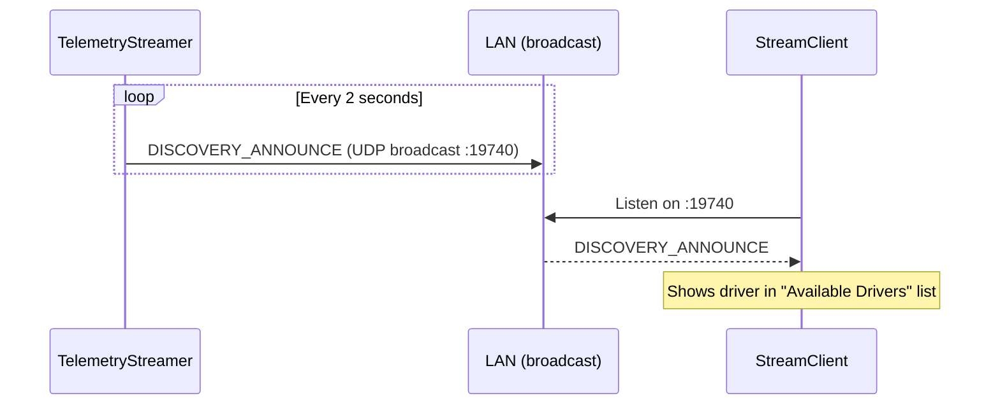
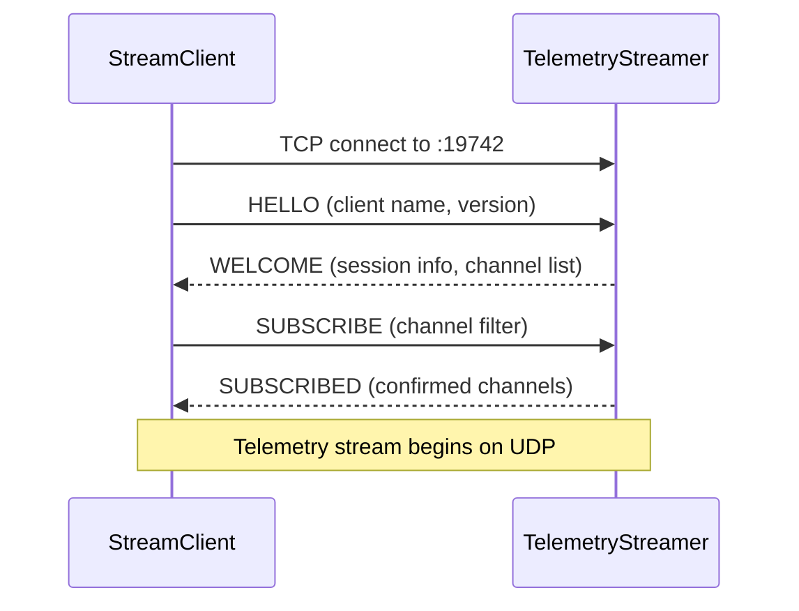
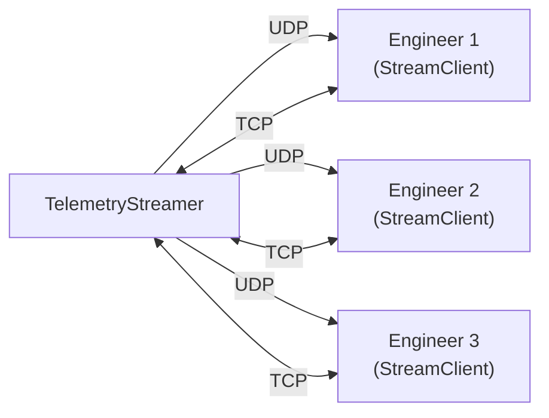
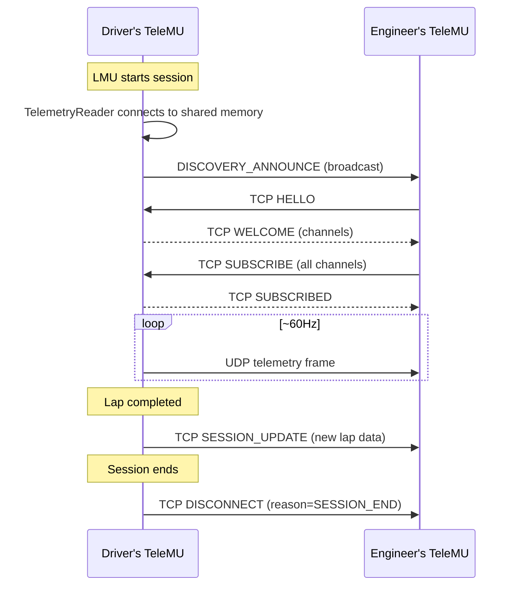

# Streaming Protocol Spec

!!! warning "Planned Feature"
    This protocol is not yet implemented. This document specifies the wire formats and sequences.

## Protocol Overview

| Channel | Transport | Port | Purpose |
|---------|-----------|------|---------|
| Discovery | UDP broadcast | 19740 | Zero-config driver announcement |
| Telemetry | UDP unicast/multicast | 19741 | High-frequency frame data |
| Control | TCP | 19742 | Handshake, subscribe, session info |

## Discovery

### Sequence



### Discovery Packet

```
Offset  Size  Field
0       4     magic: b"TMU\x02"
4       2     version: uint16
6       1     msg_type: 0x01 (DISCOVERY_ANNOUNCE)
7       32    driver_name: UTF-8, null-padded
39      64    track_name: UTF-8, null-padded
103     64    vehicle_name: UTF-8, null-padded
167     1     session_type: uint8
168     2     tcp_port: uint16 (control port, usually 19742)
170     2     udp_port: uint16 (telemetry port, usually 19741)
172     4     session_id: uint32 (unique per session)
```

## Control Channel (TCP)

### Handshake Sequence



### Control Messages

All control messages share a common header:

```
Offset  Size  Field
0       4     magic: b"TMU\x02"
4       2     length: uint16 (payload length)
6       1     msg_type: uint8
7       ...   payload (variable)
```

| msg_type | Name | Direction | Payload |
|----------|------|-----------|---------|
| `0x10` | HELLO | Client → Server | client_name (32), protocol_version (2) |
| `0x11` | WELCOME | Server → Client | session_id (4), channel_count (2), channel_list (variable) |
| `0x12` | SUBSCRIBE | Client → Server | channel_mask (variable, bitfield) |
| `0x13` | SUBSCRIBED | Server → Client | active_channels (variable, bitfield) |
| `0x14` | SESSION_UPDATE | Server → Client | track (64), vehicle (64), session_type (1) |
| `0x15` | PING | Either → Either | timestamp (8) |
| `0x16` | PONG | Either → Either | echo timestamp (8) |
| `0x1F` | DISCONNECT | Either → Either | reason (1) |

### Channel List

The WELCOME message includes available channels:

```
Per channel entry:
  channel_id: uint16
  name: char[32]
  unit: char[16]
  type: uint8 (0=float64, 1=float32, 2=int32, 3=bool)
  min_val: float64
  max_val: float64
```

## Telemetry Channel (UDP)

### Frame Packet

```
Offset  Size  Field
0       4     magic: b"TMU\x02"
4       4     session_id: uint32
8       4     sequence: uint32 (monotonic, for drop detection)
12      8     timestamp: float64 (mElapsedTime)
20      2     channel_count: uint16
22      ...   channel_data (variable)
```

### Channel Data

Each channel value in the frame:

```
Per channel:
  channel_id: uint16
  value: float64
```

### Packet Size

Typical frame with ~20 channels: `22 + (20 × 10) = 222 bytes` — well within UDP MTU.

For full telemetry (all channels): consider splitting across multiple UDP packets with a frame sequence + packet index.

## Multi-Client Support



Each client maintains its own TCP control connection and can subscribe to different channel sets. The streamer sends UDP frames to each subscribed client's address (unicast) or uses multicast if all clients want the same channels.

## Error Handling

| Scenario | Behaviour |
|----------|-----------|
| UDP packet loss | Client detects gap in sequence numbers, logs warning, continues |
| TCP disconnect | Client shows "Disconnected", retries with exponential backoff |
| Driver exits session | Server sends SESSION_UPDATE with empty track, clients show "Waiting" |
| Version mismatch | Server sends DISCONNECT with reason=VERSION_MISMATCH |
| No discovery response | Client shows "No drivers found", keeps listening |

## Sequence: Full Session



## Agent Notes

- **Wire format**: all multi-byte integers are little-endian
- **Magic bytes**: `b"TMU\x02"` (version 2 of the TMU protocol; version 1 is the .tmu file format)
- **Channel IDs**: assign sequentially; 0=speed, 1=rpm, etc. — define a canonical mapping in a shared constants module
- **MTU**: keep UDP packets under 1400 bytes to avoid fragmentation
- **Compression**: telemetry UDP frames are NOT compressed (too small, latency-sensitive); consider delta encoding for bandwidth reduction if needed
- **Security**: LAN-only, no authentication in v1 — add optional PSK in v2 if needed
- **Testing**: use loopback (127.0.0.1) for unit tests; integration test on real LAN with two processes
- **Related issues**: check project tracker for protocol and streaming issues
